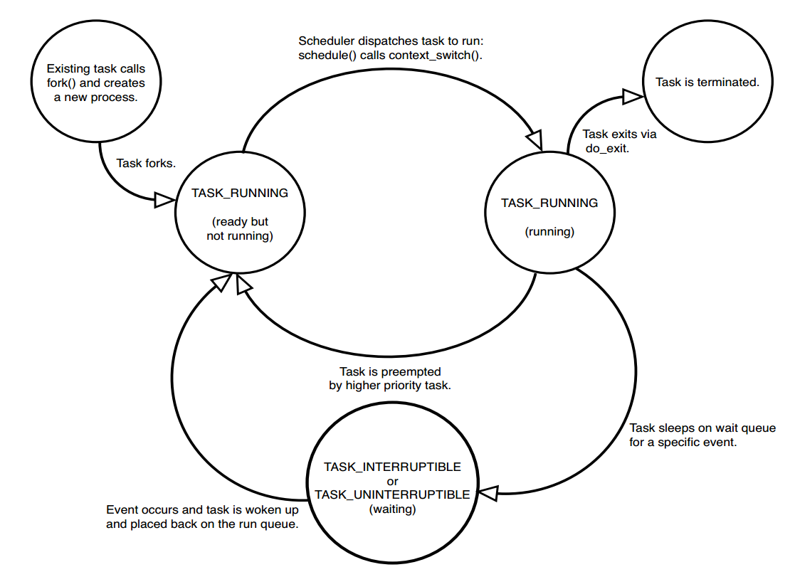
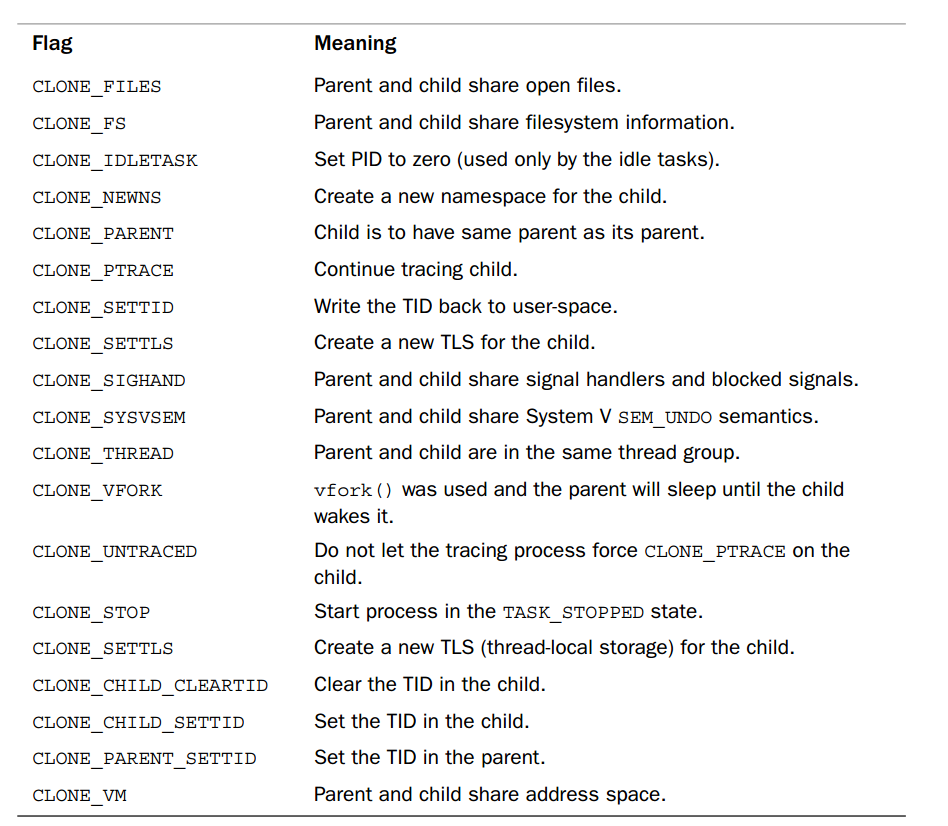

Process Management
##################

Tài liệu tham khảo: **Linux Kernel Development** (3rd Edition)

**Khái niệm**

Một process là một chương trình đang được thực thi (execute) và những tài nguyên được sử dụng bởi chương trình đang thực thi đó.

Các tài nguyên được sử dụng bởi một process bao gồm:

- File đang mở bởi process
- Signal đang chờ process xử lý
- Địa chỉ trong memory mà process đang sử dụng
- Thời gian CPU mà process đang chiếm dụng
- Các threads của process
- ...

**Process vs Thread**

Một process bao gồm ít nhất một hoặc một số thread. Các thread sẽ chạy song song thực tế  (chạy bằng nhiều core CPU) hoặc ảo (chạy bằng một core CPU nhưng lúc chạy thread này, lúc chạy thread khác).

.. note::
    Process và Thread là khái niệm ở trên User Space. Dưới kernel chỉ có một khái niệm duy nhất là Task. Task sẽ là đối tượng để scheduler quản lý. Tùy vào cấu hình, các task có thể chia sẻ hoặc không chia sẻ tài nguyên với nhau. Từ đó tạo ra khái niệm Process và Thread trên user space. Chi tiết :ref:`Process Descriptor and the Task Structure` 

Process Descriptor and the Task Structure
*****************************************

Trong linux kernel, các task là các đối tượng thực thi được quản lý bởi **scheduler**.
Các task có type là :code:`struct task_struct` này được tổ chức bằng cấu trúc dữ liệu **doubly linked list**. 
Mỗi phần tử trong doubly linklist đó được gọi là một **process descriptor** - ý muốn nói phần tử đó dùng để mô tả một process. Đúng ra nên gọi là **task descriptor**, không hiểu sao tài liệu đều để là process descriptor, chắc do quen và không quan trọng lắm.

**PID**

Mỗi **task** có **một PID độc nhất** cho task đó. PID là một biến trong :code:`struct task_struct` có kiểu dữ liệu là :code:`pid_t`.
Ban đầu người ta để giá trị lớn nhất của PID là 32768 (short int), nhưng khi hệ thống lớn nên cần nhiều process hơn nên đã nâng lên thành 4 triệu (int). Giá trị của max của PID có thể được get/set thông qua file **/proc/sys/kernel/pid_max**. Nếu hệ thống muốn có  lớn hơn 4 triệu process thì chỉ có nước là đổi typedef của :code:`pid_t` thành kiểu 64 bit rồi compile lại kernel.

**Máy trạng thái của Task**

* **TASK_RUNNING** Task đang chạy hoặc đang chờ được chạy trong queue.
* **TASK_INTERRUTABLE** Task đang ngủ, chờ một điều kiện nào đó để chạy tiếp ví dụ như ghi xong dữ liệu xuống hard drive hoặc nhận signal.
* **TASK_NONINTERRUTABLE** Giống với trạng thái **TASK_INTERRUTABLE** nhưng ở đây, task không nhận signal.
* **TASK_TRACED** Task đang bị traced bỏi một process khác, ví dự như debuger (gdb).
* **TASK_STOP** Task đã bị dừng và không thể nào quay lại trang thái **TASK_RUNNING**. Task ở trạng thái này để chờ task cha lấy thông tin trả về . Sau khi process cha lấy đủ thông tin rồi thì task mới chính thức bay màu. 

**Process Context**

Một Process chạy trên Linux sẽ có 2 mode **User Mode** và **Kernel Mode** . Thông thường process sẽ chạy ở **User Mode**. Tuy nhiên, khi process gọi **System Call** hoặc **Trigger Exception** thì process sẽ chuyển qua chạy ở **Kernel Mode**. Khi kernel chạy handler cho system call hay exception nhận được từ process thì ta cũng có thể nói rằng Kernel đang chạy "on behalf of the process" hay đang trong **process context**.

**Process Family Tree**

Các process trong Linux được tổ chức theo quan hệ cha con. **init** process có PID = 1 và là process duy nhất không có process cha. Tất cả các process khác đều là con cháu của **init** process. Mỗi process đó sẽ có 1 process cha và 0 hoặc một số process con. Trong process descriptor sẽ có một pointer trỏ tới process cha và một list các con trỏ trỏ tới process con của nó.

Kernel process sẽ là process con của **kthreadd** (PID=2). Để  list các process của kernel ta dùng câu lệnh sau:

.. code:: bash

    ps --ppid 2 -o uname,ppid,pid,cmd

Process Creation
****************

Đa phần các hệ điều hành sẽ implement một có chế **spawn** để tạo ra một process mới.
Tuy nhiên, đối với Unix system trong đó có Linux, để tạo ra một process mới cần thực hiện hai bước:

* **fork()**: Tạo ra một process con là copy của process hiện tại.
* **exec()**: Load chương trình lên RAM và thực hiện chương trình đó.

**Copy-on-Write**

Khi thực hiện lệnh **fork()**, tất cả các tài nguyên của process cha sẽ được duplicated cho process con. Nếu implement một cách ngây thơ (naive) thì copy kiểu này sẽ rất không hiệu quả vì phải copy quá nhiều thứ mà có khi không cần dùng đến sau này. Trong trường hợp chạy luôn chương trình mới thì coi như mất công copy qua gần không dùng được gì cả. Do đó, **fork()** của Linux implement một cơ chế gọi là **Copy-on-Write**, tức là chỉ thực hiện copy ra chỗ khác khi cần write, còn nếu không đụng tới hoặc chỉ read thui thì không cần copy chi cho tốn công.

Đơn vị nhỏ nhất của **Copy-on-Write** là page. Tức là nếu cần write vào một byte trong page thì cũng phải copy cả page.

**Forking**

Linux implement **fork** thông qua **CLONE** system call, tức là khi gọi hàm **fork()** trong **C** thì bản chất là ta đang gọi system call **CLONE** thông qua hàm cung cấp bởi thư viện **glibc** của ngôn ngữ lập trình **C**.

Tùy thuộc vào tham số được truyền vào khi gọi system call **CLONE** mà process mới và process cha sẽ dùng chung hoặc không một số tài nguyên nhất định. Ví dụ như để tạo ra thread với thì **CLONE** ra process mới chia sẻ chung memory với process cha.

System call **CLONE** được handle bởi hàm **do_fork()**, hàm **do_fork()** làm một số công việc chính như sau:

* Duplicate task descriptor từ task cha qua task con.
* Check resouce limit: số lượng task tối đa được sở hữu bởi một user.
* Cập nhật của thông số của task descriptor cuả task con cho phù hợp với yêu cầu của task mới.
* Tạo PID cho task con.
* Duplicate hoặc tạo mới cái resouces của task con: open file system, signal hanlder, process address space, namespace.
* Clean và trả lại pointer trỏ tới task con.

Sau khi được clone thành công, để tối ưu, process con thường được chạy trước process cha. Thông thường, process sẽ exec một chương trình mới ngay sau khi được fork ra thành công. Do đó, nếu process cha chạy trước và process cha có ghi dữ liệu thì cơ chế **COPY-ON-WRITE** được kích hoạt và dữ liệu được copy để write. Nếu process cha chạy sau khi process con đã exec một program mới thì không cần phải copy on write.

Linux implementation of Threads
*******************************
Multi thread programing là một kỹ thuật qua trọng trong lập trình. Linux có cách implement thread không giống với MS Windows và Sun Solaris. 

Trong Linux kernel, không có khái niệm Thread. Linux coi Thread như là những process thông thường khác. Linux không có struct nào dành riêng cho thread cũng như không cung cấp cơ chế schedule đặc biệt cho thread. Thread đơn giản chỉ là một process mà process đó chia sẻ một số tài nguyên nhất định với process khác. Các tài nguyên đó thông thường là không gian địa chỉ bộ nhớ, các files đang được mở,...

Cách tiếp cận này rất khác với MS Windows và Sun Solaris. Hai hệ điều hành này có cơ chế đặc biệt dành cho thread. Thread ở hai hệ điều hành này thường được xem là **lightweight process**. Cụm từ **lightweight** process cho thấy sự khác biệt trong triết lý về thread giữa Linux và các hệ thống khác. Giả sử ta có một Process có 4 thread. Trong hệ thống có cơ chế đặc biệt cho thread, ta sẽ có một process descriptor chứa 4 pointer point tới 4 thread. Process descriptor sẽ chứa thông tin chia sẻ bởi 4 thread, còn các thông tin riêng của từng thread thì được lưu trong struct riêng của từng thread đó. Ngược lại, trong Linux, cả 4 thread đều có process descriptor riêng và được cấu hình để chia sẻ một số tài nguyên nhất định.

**Tạo Thread mới**

Thread được tạo bằng system call **CLONE** giống như một task thông thường. Tuy nhiên, một số  cờ được bật để chia sẻ tài nguyên giữa task cha và task con, tạo ra khái niệm thread.

.. code:: C

    clone(CLONE_VM | CLONE_FS | CLONE_FILES | CLONE_SIGHAND, 0);

Để tạo ra thread thì các tài nguyên được chia sẻ là:

* Address space :code:`CLONE_VM`
* File system information :code:`CLONE_FS`
* File descriptors :code:`CLONE_FILES`
* Signal hanlder :code:`CLONE_SIGHAND`

Process thông thường được clone bằng:

.. code:: C

    clone(SIGCHILD, 0);

Dưới đây là danh sách một số flag dùng được cho hàm :code:`clone()` và ý nghĩa của từng flag đó.

**Kernel Threads**

Kernel thread là một task chỉ tồn tại trong kernel space, thường được dùng để  chạy một số task trong background. Sự khác biệt chính giữa Kernel Thread và Process thông thường là Kernel Thread không có không gian địa chỉ (con trỏ :code:`mm` trong struct là :code:`NULL`). Kernel Thread chỉ chạy trong kernel-space, không có context swicth qua user-space. Kernel Thread được scheduler schedule như là một task thông thường, không có sự phân biệt với các task khác.

Trong Linux Kernel, kernel thread thường được sử dụng để làm task phụ, nhằm mục đích hoàn thành một số  nhiệm vụ nhất định trong trong khi task chính tiếp tục chạy, điển hình như **flush** (đẩy dữ liệu trong buffer ra thiết bên ngoài như hardrive, network module) và **ksoftirqd** (handle interrupt trong thread thay vì trong hardware interrupt handler).

Kernel thread chỉ có thể được tạo ra bởi một kernel thread. Kernel thread đầu tiên là là **kthreadd**. **kthreadd** có thường có pid là 2 và có parent ID là 0, nghĩa là không có thread cha.

Có thể  liệt kê các kernel thread bằng command sau:

.. code:: bash 

    ps -ef

Process Termination
********************

Khi process được terminate thì:
 *  Clear resources sử  dụng bởi process
 *  Thông báo cho process cha.

Sau khi hoàn thành 2 công việc trên thì process vào trạng thái **EXIT_ZOMBIE**. Lúc này task không còn có thể được schedule nhưng vẫn còn giữ **pid**. Sau khi parent của task handle các một số thông tin về  task hoặc notify kernel rằng nó không quan tâm thì tất cả các dữ liệu của task mới được xóa hoàn toàn và **pid** được trả lại để cho task khác sử dụng.

 
**Dilemma of Parentless Task**

Trong trường hợp process cha exit trước process con thì chúng ta cần một cơ chế  để **reparent** các process con để  các process con nhận parent mới. Linux sẽ sử dụng một process khác trong cùng thread group hoặc **init** process (trong trường hợp cách làm trước fail) để làm cha mới cho những đứa trẻ mồ côi.
