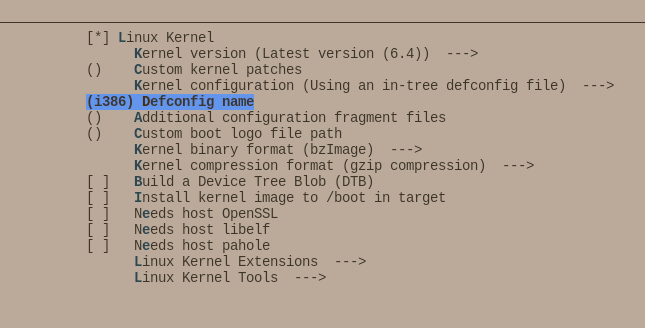

=========
Buildroot
=========

Buildroot is a simple, efficient and easy-to-use tool to generate embedded Linux systems through cross-compilation.

* Linux Kernel: bzImage
* Rootfs: rootfs.ext2

Link: https://buildroot.org/download.html

Build Kernel
============

.. code-block::

    make menuconfig
    make linux-menuconfig 

Build BusyBox
=============

BusyBox **combines tiny versions of many common UNIX utilities into a single small executable**. It provides replacements for most of the utilities you usually find in GNU fileutils, shellutils, etc. 

The utilities in BusyBox generally have fewer options than their full-featured GNU cousins; however, the options that are included provide the expected functionality and behave very much like their GNU counterparts.

BusyBox provides a fairly complete environment for any small or embedded system.

.. code-block:: 

    make busybox-menuconfig 
    make

Build Rootfs
============

.. code-block::

    make menuconfig

.. code-block:: 

    # cat /proc/cmdline 
    BOOT_IMAGE=/boot/vmlinuz-5.15.0-84-generic root=UUID=67c0a593-2586-449c-83da-a45a4b6ec122 ro quiet splash vt.handoff=7

Buildroot over QEMU
===================

.. code-block:: bash

    qemu-system-x86_64 \
        -kernel ./output/images/bzImage \
        -initrd ./output/images/rootfs.cpio

    qemu-system-x86_64 \
        -M pc \
        -kernel ./output/images/bzImage \
        -drive file=./output/images/rootfs.ext2,if=virtio,format=raw \
        -append "root=/dev/vda console=ttyS0" \
        -net nic,model=virtio -net user \
        -nographic

    qemu-system-i386 \
        -M pc \
        -kernel ./output/images/bzImage \
        -drive file=./output/images/rootfs.ext2,if=virtio,format=raw \
        -append "root=/dev/vda console=ttyS0" \
        -net nic,model=virtio -net user \
        -nographic
