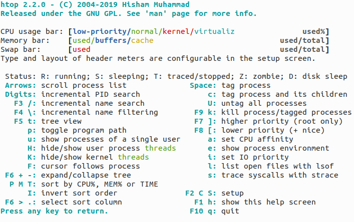

=================================
Memory Management in Linux Kernel
=================================

.. toctree::

   physical_memory
   virtual_memory

Link: https://www.baeldung.com/linux/proc-meminfo

Link: https://access.redhat.com/documentation/en-us/red_hat_enterprise_linux/6/html/deployment_guide/s2-proc-meminfo

Mem Info
========

htop
----

.. code-block:: 

   # cat /proc/meminfo            
   MemTotal:       15711928 kB
   MemFree:         2805788 kB
   MemAvailable:    9427716 kB
   Buffers:          608080 kB
   Cached:          5906256 kB
   SwapCached:            0 kB
   Active:          2172532 kB
   Inactive:        8428948 kB
   Active(anon):      23928 kB
   Inactive(anon):  4345772 kB
   Active(file):    2148604 kB
   Inactive(file):  4083176 kB
   Unevictable:         160 kB
   Mlocked:             160 kB
   SwapTotal:      10485756 kB
   SwapFree:       10485756 kB
   Dirty:              3524 kB
   Writeback:             0 kB
   AnonPages:       4087460 kB
   Mapped:          1343444 kB
   Shmem:            282556 kB
   KReclaimable:     724672 kB
   Slab:             918884 kB
   SReclaimable:     724672 kB
   SUnreclaim:       194212 kB
   KernelStack:       24336 kB
   PageTables:        65452 kB
   NFS_Unstable:          0 kB
   Bounce:                0 kB
   WritebackTmp:          0 kB
   CommitLimit:    18341720 kB
   Committed_AS:   18876448 kB
   VmallocTotal:   34359738367 kB
   VmallocUsed:       60284 kB
   VmallocChunk:          0 kB
   Percpu:            16384 kB
   HardwareCorrupted:     0 kB
   AnonHugePages:    145408 kB
   ShmemHugePages:        0 kB
   ShmemPmdMapped:        0 kB
   FileHugePages:         0 kB
   FilePmdMapped:         0 kB
   HugePages_Total:       0
   HugePages_Free:        0
   HugePages_Rsvd:        0
   HugePages_Surp:        0
   Hugepagesize:       2048 kB
   Hugetlb:               0 kB
   DirectMap4k:     1722380 kB
   DirectMap2M:    13340672 kB
   DirectMap1G:     2097152 kB

General Memory
--------------

.. code-block:: 

   cat /proc/meminfo | grep "Mem"
   MemTotal:       15711928 kB
   MemFree:         1672960 kB
   MemAvailable:    8346296 kB

* **MemTotal**: total usable RAM
* **MemFree**: represents the amount of physical RAM that is currently not being used by the system for any purpose.
* **MemAvailable**: takes into account not only the free memory but also the memory used by the file system cache and buffers that can be made available to applications without causing excessive swapping. It represents an estimate of how much memory is available for memory allocation without causing excessive swapping or compromising system performance.

Buffer and Cache
----------------

.. code-block:: 

   # cat /proc/meminfo | grep -e "Buffers" -we "Cached" 
   Buffers:          624472 kB
   Cached:          6108984 kB

* **Buffers**: When data is read from or written to the disk, the Linux kernel uses a portion of memory to store this data temporarily. This helps to improve I/O performance by reducing the need to repeatedly access the slower disk storage.
* **Cached**: When files are read from disk, the Linux kernel caches frequently accessed data in memory to accelerate subsequent access. This cache is called the page cache.

**Buffers** and **Cached** memory in the **meminfo** output both relate to memory used for optimizing I/O operations, but they serve slightly different purposes. **Buffers** are associated with data actively being transferred between RAM and the disk, while **Cached** memory is used for caching frequently accessed files and can be easily reclaimed by the system when needed for other tasks.

Swap
----

.. code-block:: 

   # cat /proc/meminfo | grep "Swap" 
   SwapCached:            0 kB
   SwapTotal:      10485756 kB
   SwapFree:       10485756 kB

* **SwapCached**: recently used swap memory, which increases the speed of I/O
* **SwapTotal**: the total amount of swap space available in the system
* **SwapFree**: unused swap space, the memory that has been transferred from RAM to the disk temporarily
