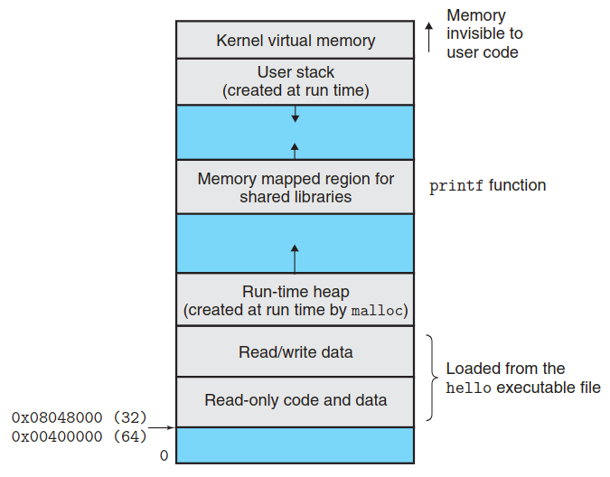

==============
Virtual Memory
==============

Virtual Memory in x86
---------------------

.. code-block::

    # cat /proc/self/maps 
    0048f000-00495000 r--p 00000000 fd:00 17         /bin/busybox
    00495000-00520000 r-xp 00006000 fd:00 17         /bin/busybox
    00520000-00548000 r--p 00091000 fd:00 17         /bin/busybox
    00548000-0054a000 r--p 000b8000 fd:00 17         /bin/busybox
    0054a000-0054b000 rw-p 000ba000 fd:00 17         /bin/busybox
    b7dfe000-b7e20000 r--p 00000000 fd:00 139        /lib/libc.so.6
    b7e20000-b7f13000 r-xp 00022000 fd:00 139        /lib/libc.so.6
    b7f13000-b7f64000 r--p 00115000 fd:00 139        /lib/libc.so.6
    b7f64000-b7f66000 r--p 00166000 fd:00 139        /lib/libc.so.6
    b7f66000-b7f67000 rw-p 00168000 fd:00 139        /lib/libc.so.6
    b7f67000-b7f71000 rw-p 00000000 00:00 0 
    b7f71000-b7f73000 r--p 00000000 fd:00 148        /lib/libresolv.so.2
    b7f73000-b7f79000 r-xp 00002000 fd:00 148        /lib/libresolv.so.2
    b7f79000-b7f7b000 r--p 00008000 fd:00 148        /lib/libresolv.so.2
    b7f7b000-b7f7c000 r--p 0000a000 fd:00 148        /lib/libresolv.so.2
    b7f7c000-b7f7d000 rw-p 0000b000 fd:00 148        /lib/libresolv.so.2
    b7f7d000-b7f81000 rw-p 00000000 00:00 0 
    b7f81000-b7f85000 r--p 00000000 00:00 0          [vvar]
    b7f85000-b7f87000 r-xp 00000000 00:00 0          [vdso]
    b7f87000-b7f88000 r--p 00000000 fd:00 134        /lib/ld-linux.so.2
    b7f88000-b7fa2000 r-xp 00001000 fd:00 134        /lib/ld-linux.so.2
    b7fa2000-b7fac000 r--p 0001b000 fd:00 134        /lib/ld-linux.so.2
    b7fac000-b7fae000 r--p 00024000 fd:00 134        /lib/ld-linux.so.2
    b7fae000-b7faf000 rw-p 00026000 fd:00 134        /lib/ld-linux.so.2
    bfa03000-bfa24000 rw-p 00000000 00:00 0          [stack]
    # 

.. code-block:: 

    # cat /proc/24397/maps 
    565ab000-565ac000 r--p 00000000 103:05 10490348                          /home/tuannv/ws/blog/ewm/source/01_linux/general/process/src/hello
    565ac000-565ad000 r-xp 00001000 103:05 10490348                          /home/tuannv/ws/blog/ewm/source/01_linux/general/process/src/hello
    565ad000-565ae000 r--p 00002000 103:05 10490348                          /home/tuannv/ws/blog/ewm/source/01_linux/general/process/src/hello
    565ae000-565af000 r--p 00002000 103:05 10490348                          /home/tuannv/ws/blog/ewm/source/01_linux/general/process/src/hello
    565af000-565b0000 rw-p 00003000 103:05 10490348                          /home/tuannv/ws/blog/ewm/source/01_linux/general/process/src/hello
    57ed1000-57ef3000 rw-p 00000000 00:00 0                                  [heap]
    f7d25000-f7d3e000 r--p 00000000 103:04 531884                            /usr/lib/i386-linux-gnu/libc-2.31.so
    f7d3e000-f7e99000 r-xp 00019000 103:04 531884                            /usr/lib/i386-linux-gnu/libc-2.31.so
    f7e99000-f7f0d000 r--p 00174000 103:04 531884                            /usr/lib/i386-linux-gnu/libc-2.31.so
    f7f0d000-f7f0e000 ---p 001e8000 103:04 531884                            /usr/lib/i386-linux-gnu/libc-2.31.so
    f7f0e000-f7f10000 r--p 001e8000 103:04 531884                            /usr/lib/i386-linux-gnu/libc-2.31.so
    f7f10000-f7f11000 rw-p 001ea000 103:04 531884                            /usr/lib/i386-linux-gnu/libc-2.31.so
    f7f11000-f7f14000 rw-p 00000000 00:00 0 
    f7f47000-f7f49000 rw-p 00000000 00:00 0 
    f7f49000-f7f4d000 r--p 00000000 00:00 0                                  [vvar]
    f7f4d000-f7f4f000 r-xp 00000000 00:00 0                                  [vdso]
    f7f4f000-f7f50000 r--p 00000000 103:04 529708                            /usr/lib/i386-linux-gnu/ld-2.31.so
    f7f50000-f7f6e000 r-xp 00001000 103:04 529708                            /usr/lib/i386-linux-gnu/ld-2.31.so
    f7f6e000-f7f79000 r--p 0001f000 103:04 529708                            /usr/lib/i386-linux-gnu/ld-2.31.so
    f7f7a000-f7f7b000 r--p 0002a000 103:04 529708                            /usr/lib/i386-linux-gnu/ld-2.31.so
    f7f7b000-f7f7c000 rw-p 0002b000 103:04 529708                            /usr/lib/i386-linux-gnu/ld-2.31.so
    ffd5a000-ffd7c000 rw-p 00000000 00:00 0                                  [stack]

.. code-block:: 

    (gdb) info proc mappings
    process 23610
    Mapped address spaces:

            Start Addr   End Addr       Size     Offset objfile
            0x56555000 0x56556000     0x1000        0x0 /home/tuannv/ws/blog/ewm/source/01_linux/general/process/src/hello
            0x56556000 0x56557000     0x1000     0x1000 /home/tuannv/ws/blog/ewm/source/01_linux/general/process/src/hello
            0x56557000 0x56558000     0x1000     0x2000 /home/tuannv/ws/blog/ewm/source/01_linux/general/process/src/hello
            0x56558000 0x56559000     0x1000     0x2000 /home/tuannv/ws/blog/ewm/source/01_linux/general/process/src/hello
            0x56559000 0x5655a000     0x1000     0x3000 /home/tuannv/ws/blog/ewm/source/01_linux/general/process/src/hello
            0x5655a000 0x5657c000    0x22000        0x0 [heap]
            0xf7da7000 0xf7dc0000    0x19000        0x0 /usr/lib/i386-linux-gnu/libc-2.31.so
            0xf7dc0000 0xf7f1b000   0x15b000    0x19000 /usr/lib/i386-linux-gnu/libc-2.31.so
            0xf7f1b000 0xf7f8f000    0x74000   0x174000 /usr/lib/i386-linux-gnu/libc-2.31.so
            0xf7f8f000 0xf7f90000     0x1000   0x1e8000 /usr/lib/i386-linux-gnu/libc-2.31.so
            0xf7f90000 0xf7f92000     0x2000   0x1e8000 /usr/lib/i386-linux-gnu/libc-2.31.so
            0xf7f92000 0xf7f93000     0x1000   0x1ea000 /usr/lib/i386-linux-gnu/libc-2.31.so
            0xf7f93000 0xf7f96000     0x3000        0x0 
            0xf7fc9000 0xf7fcb000     0x2000        0x0 
            0xf7fcb000 0xf7fcf000     0x4000        0x0 [vvar]
            0xf7fcf000 0xf7fd1000     0x2000        0x0 [vdso]
            0xf7fd1000 0xf7fd2000     0x1000        0x0 /usr/lib/i386-linux-gnu/ld-2.31.so
            0xf7fd2000 0xf7ff0000    0x1e000     0x1000 /usr/lib/i386-linux-gnu/ld-2.31.so
            0xf7ff0000 0xf7ffb000     0xb000    0x1f000 /usr/lib/i386-linux-gnu/ld-2.31.so
            0xf7ffc000 0xf7ffd000     0x1000    0x2a000 /usr/lib/i386-linux-gnu/ld-2.31.so
            0xf7ffd000 0xf7ffe000     0x1000    0x2b000 /usr/lib/i386-linux-gnu/ld-2.31.so
            0xfffdc000 0xffffe000    0x22000        0x0 [stack]

Virtual Memory in x86_64
------------------------

.. code-block:: 

    # cat /proc/self/maps
    558edb3af000-558edb3b1000 r--p 00000000 103:04 526427                    /usr/bin/cat
    558edb3b1000-558edb3b6000 r-xp 00002000 103:04 526427                    /usr/bin/cat
    558edb3b6000-558edb3b9000 r--p 00007000 103:04 526427                    /usr/bin/cat
    558edb3b9000-558edb3ba000 r--p 00009000 103:04 526427                    /usr/bin/cat
    558edb3ba000-558edb3bb000 rw-p 0000a000 103:04 526427                    /usr/bin/cat
    558edd23c000-558edd25d000 rw-p 00000000 00:00 0                          [heap]
    7f878df76000-7f878e7ff000 r--p 00000000 103:04 525597                    /usr/lib/locale/locale-archive
    7f878e7ff000-7f878e821000 r--p 00000000 103:04 528715                    /usr/lib/x86_64-linux-gnu/libc-2.31.so
    7f878e821000-7f878e999000 r-xp 00022000 103:04 528715                    /usr/lib/x86_64-linux-gnu/libc-2.31.so
    7f878e999000-7f878e9e7000 r--p 0019a000 103:04 528715                    /usr/lib/x86_64-linux-gnu/libc-2.31.so
    7f878e9e7000-7f878e9eb000 r--p 001e7000 103:04 528715                    /usr/lib/x86_64-linux-gnu/libc-2.31.so
    7f878e9eb000-7f878e9ed000 rw-p 001eb000 103:04 528715                    /usr/lib/x86_64-linux-gnu/libc-2.31.so
    7f878e9ed000-7f878e9f3000 rw-p 00000000 00:00 0 
    7f878ea04000-7f878ea26000 rw-p 00000000 00:00 0 
    7f878ea26000-7f878ea27000 r--p 00000000 103:04 528699                    /usr/lib/x86_64-linux-gnu/ld-2.31.so
    7f878ea27000-7f878ea4a000 r-xp 00001000 103:04 528699                    /usr/lib/x86_64-linux-gnu/ld-2.31.so
    7f878ea4a000-7f878ea52000 r--p 00024000 103:04 528699                    /usr/lib/x86_64-linux-gnu/ld-2.31.so
    7f878ea53000-7f878ea54000 r--p 0002c000 103:04 528699                    /usr/lib/x86_64-linux-gnu/ld-2.31.so
    7f878ea54000-7f878ea55000 rw-p 0002d000 103:04 528699                    /usr/lib/x86_64-linux-gnu/ld-2.31.so
    7f878ea55000-7f878ea56000 rw-p 00000000 00:00 0 
    7ffdb31b5000-7ffdb31d7000 rw-p 00000000 00:00 0                          [stack]
    7ffdb31fa000-7ffdb31fe000 r--p 00000000 00:00 0                          [vvar]
    7ffdb31fe000-7ffdb3200000 r-xp 00000000 00:00 0                          [vdso]
    ffffffffff600000-ffffffffff601000 --xp 00000000 00:00 0                  [vsyscall]

.. code-block:: 

    # pmap 21290    
    21290:   /usr/bin/zsh --login
    0000562c588da000     92K r---- zsh
    0000562c588f1000    596K r-x-- zsh
    0000562c58986000    136K r---- zsh
    0000562c589a9000      8K r---- zsh
    0000562c589ab000     24K rw--- zsh
    0000562c589b1000     80K rw---   [ anon ]
    0000562c5a327000   3820K rw---   [ anon ]
    00007ff0c8ce3000     12K r---- computil.so
    00007ff0c8ce6000     52K r-x-- computil.so
    00007ff0c8cf3000      8K r---- computil.so
    00007ff0c8cf5000      4K r---- computil.so
    00007ff0c8cf6000      4K rw--- computil.so
    00007ff0c8cf7000   2560K r--s- Unix.zwc
    00007ff0c8f82000    148K r--s- Zsh.zwc
    00007ff0c8fbe000    100K r--s- Zle.zwc
    00007ff0c8fe3000      4K r---- zleparameter.so
    00007ff0c8fe4000      4K r-x-- zleparameter.so
    00007ff0c8fe5000      4K r---- zleparameter.so
    00007ff0c8fe6000      4K r---- zleparameter.so
    00007ff0c8fe7000      4K rw--- zleparameter.so
    00007ff0c8feb000     12K r---- system.so
    00007ff0c8fee000      8K r-x-- system.so
    00007ff0c8ff0000      4K r---- system.so
    00007ff0c8ff1000      4K ----- system.so
    00007ff0c8ff2000      4K r---- system.so
    00007ff0c8ff3000      4K rw--- system.so
    00007ff0c8ff4000    100K r--s- Misc.zwc
    00007ff0c9015000    144K r--s- Base.zwc
    00007ff0c9039000      4K r---- stat.so
    00007ff0c903a000      8K r-x-- stat.so
    00007ff0c903c000      4K r---- stat.so
    00007ff0c903d000      4K r---- stat.so
    00007ff0c903e000      4K rw--- stat.so
    00007ff0c9048000      4K r---- regex.so
    00007ff0c9049000      4K r-x-- regex.so
    00007ff0c904a000      4K r---- regex.so
    00007ff0c904b000      4K r---- regex.so
    00007ff0c904c000      4K rw--- regex.so
    00007ff0c904d000      4K r---- langinfo.so
    00007ff0c904e000      4K r-x-- langinfo.so
    00007ff0c904f000      4K r---- langinfo.so
    00007ff0c9050000      4K r---- langinfo.so
    00007ff0c9051000      4K rw--- langinfo.so
    00007ff0c9052000     16K r---- complist.so
    00007ff0c9056000     44K r-x-- complist.so
    00007ff0c9061000      4K r---- complist.so
    00007ff0c9062000      4K ----- complist.so
    00007ff0c9063000      4K r---- complist.so
    00007ff0c9064000      4K rw--- complist.so
    00007ff0c9065000      8K r---- datetime.so
    00007ff0c9067000      4K r-x-- datetime.so
    00007ff0c9068000      4K r---- datetime.so
    00007ff0c9069000      4K r---- datetime.so
    00007ff0c906a000      4K rw--- datetime.so
    00007ff0c906b000     96K r--s- Completion.zwc
    00007ff0c9087000     12K r---- parameter.so
    00007ff0c908a000     20K r-x-- parameter.so
    00007ff0c908f000      8K r---- parameter.so
    00007ff0c9091000      4K ----- parameter.so
    00007ff0c9092000      4K r---- parameter.so
    00007ff0c9093000      4K rw--- parameter.so
    00007ff0c9094000     32K r---- complete.so
    00007ff0c909c000    100K r-x-- complete.so
    00007ff0c90b5000     12K r---- complete.so
    00007ff0c90b8000      4K ----- complete.so
    00007ff0c90b9000      4K r---- complete.so
    00007ff0c90ba000      4K rw--- complete.so
    00007ff0c90bb000     88K r---- zle.so
    00007ff0c90d1000    168K r-x-- zle.so
    00007ff0c90fb000     36K r---- zle.so
    00007ff0c9104000      4K ----- zle.so
    00007ff0c9105000      8K r---- zle.so
    00007ff0c9107000     28K rw--- zle.so
    00007ff0c910e000      4K rw---   [ anon ]
    00007ff0c910f000   8740K r---- locale-archive
    00007ff0c9998000      8K rw---   [ anon ]
    00007ff0c999a000    136K r---- libc-2.31.so
    00007ff0c99bc000   1504K r-x-- libc-2.31.so
    00007ff0c9b34000    312K r---- libc-2.31.so
    00007ff0c9b82000     16K r---- libc-2.31.so
    00007ff0c9b86000      8K rw--- libc-2.31.so
    00007ff0c9b88000     16K rw---   [ anon ]
    00007ff0c9b8c000     52K r---- libm-2.31.so
    00007ff0c9b99000    668K r-x-- libm-2.31.so
    00007ff0c9c40000    612K r---- libm-2.31.so
    00007ff0c9cd9000      4K r---- libm-2.31.so
    00007ff0c9cda000      4K rw--- libm-2.31.so
    00007ff0c9cdb000     56K r---- libtinfo.so.6.2
    00007ff0c9ce9000     60K r-x-- libtinfo.so.6.2
    00007ff0c9cf8000     56K r---- libtinfo.so.6.2
    00007ff0c9d06000     16K r---- libtinfo.so.6.2
    00007ff0c9d0a000      4K rw--- libtinfo.so.6.2
    00007ff0c9d0b000      4K r---- libdl-2.31.so
    00007ff0c9d0c000      8K r-x-- libdl-2.31.so
    00007ff0c9d0e000      4K r---- libdl-2.31.so
    00007ff0c9d0f000      4K r---- libdl-2.31.so
    00007ff0c9d10000      4K rw--- libdl-2.31.so
    00007ff0c9d11000      8K r---- libcap.so.2.32
    00007ff0c9d13000     12K r-x-- libcap.so.2.32
    00007ff0c9d16000      4K r---- libcap.so.2.32
    00007ff0c9d17000      4K ----- libcap.so.2.32
    00007ff0c9d18000      4K r---- libcap.so.2.32
    00007ff0c9d19000      4K rw--- libcap.so.2.32
    00007ff0c9d1a000      8K rw---   [ anon ]
    00007ff0c9d1c000      8K r---- zutil.so
    00007ff0c9d1e000     20K r-x-- zutil.so
    00007ff0c9d23000      4K r---- zutil.so
    00007ff0c9d24000      4K ----- zutil.so
    00007ff0c9d25000      4K r---- zutil.so
    00007ff0c9d26000      4K rw--- zutil.so
    00007ff0c9d27000      4K r---- terminfo.so
    00007ff0c9d28000      4K r-x-- terminfo.so
    00007ff0c9d29000      4K r---- terminfo.so
    00007ff0c9d2a000      4K r---- terminfo.so
    00007ff0c9d2b000      4K rw--- terminfo.so
    00007ff0c9d30000     28K r--s- gconv-modules.cache
    00007ff0c9d37000     12K r---- libnss_files-2.31.so
    00007ff0c9d3a000     28K r-x-- libnss_files-2.31.so
    00007ff0c9d41000      8K r---- libnss_files-2.31.so
    00007ff0c9d43000      4K r---- libnss_files-2.31.so
    00007ff0c9d44000      4K rw--- libnss_files-2.31.so
    00007ff0c9d45000     40K rw---   [ anon ]
    00007ff0c9d4f000      4K r---- ld-2.31.so
    00007ff0c9d50000    140K r-x-- ld-2.31.so
    00007ff0c9d73000     32K r---- ld-2.31.so
    00007ff0c9d7c000      4K r---- ld-2.31.so
    00007ff0c9d7d000      4K rw--- ld-2.31.so
    00007ff0c9d7e000      4K rw---   [ anon ]
    00007fff6d4cf000    324K rw---   [ stack ]
    00007fff6d5a2000     16K r----   [ anon ]
    00007fff6d5a6000      8K r-x--   [ anon ]
    ffffffffff600000      4K --x--   [ anon ]
    total            21816K
