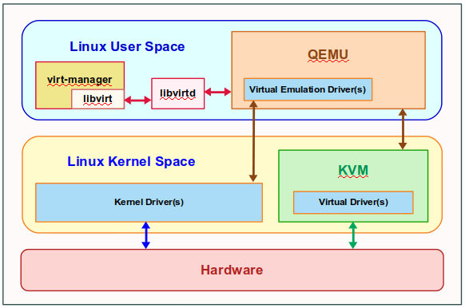

==============
Virtualization
==============

.. toctree:: 
    
    qemu/index

Hypervisor
----------
Also known as the Virtual Machine Manager is a computer supervisor software that allows one to create and run one or more Virtual Machines (running their own operating system).

The host on which the hypervisor runs is referred to has the Host machine, while each of the virtual machine(s) are referred to as the Guest machine(s).

The hypervisor gives each virtual machine the illusion that it is running on its own physical hardware through virtualization of the underlying physical hardware resources, such as the disk, network, video, etc.

* Type 1 Hypervisor **Bare-Metal Hypervisor**:

  * **Installed directly on the physical hardware**: Type 1 hypervisors run directly on the host's hardware without the need for an underlying operating system. This means they have direct access to the server's resources.

  * **High performance**: Since they run directly on the hardware, Type 1 hypervisors typically offer better performance and resource isolation compared to Type 2 hypervisors.

  * **Examples**: VMware vSphere/ESXi, Microsoft Hyper-V (when installed in a standalone mode), Xen, and KVM.

  * **Use cases**: Type 1 hypervisors are commonly used in enterprise environments, data centers, and cloud infrastructure where performance and resource control are critical.

* Type 2 Hypervisor **Hosted Hypervisor**:
  
  * **Installed on top of an operating system**: Type 2 hypervisors run on top of an existing operating system (host OS). This means they rely on the host OS to manage hardware resources.

  * **Lower performance**: Since they operate through the host OS, Type 2 hypervisors may introduce some overhead, leading to slightly lower performance compared to Type 1 hypervisors.

  * **Examples**: Oracle VirtualBox, VMware Workstation, Parallels Desktop (for Mac), and VMware Player.

  * **Use cases**: Type 2 hypervisors are often used for development, testing, and desktop virtualization scenarios, where ease of use and flexibility are more important than maximum performance.

Qemu
----
A generic and open source machine emulator and virtualizer

KVM
---
KVM (Kernel Virtual Machine) is a Linux kernel module that allows a user space program to utilize the hardware virtualization features of various processors.

QEMU can make use of KVM when running a target architecture that is the same as the host architecture. 

To use KVM pass --enable-kvm to QEMU.

