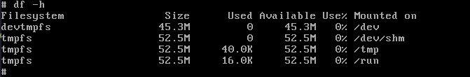

===========================
QEMU - Open-source emulator
===========================

* Emulator
* Virtualizer

Components:

* Bootloader
* Kernel
* Filesystem

QEMU Example
============

.. code-block:: bash

    cd buildroot

    qemu-system-x86_64 \
        -M pc \
        -kernel ./output/images/bzImage \
        -drive file=./output/images/rootfs.ext2,if=virtio,format=raw \
        -append "root=/dev/vda console=ttyS0" \
        -net nic,model=virtio -net user \
        -nographic

    qemu-system-i386 \
        -M pc \
        -kernel ./output/images/bzImage \
        -drive file=./output/images/rootfs.ext2,if=virtio,format=raw \
        -append "root=/dev/vda console=ttyS0" \
        -net nic,model=virtio -net user \
        -nographic

QEMU Options
============

Option :code:`-M`
-----------------

* Machine type or motherboard model.
* **Automatic Machine Selection**: don't specify the :code:`-M` option ➜ automatically select a suitable machine type based on other options and configurations. For example, use the :code:`-cpu` option to specify a CPU model ➜ select a machine type that matches that CPU.
* :code:`-M pc-i440fx-2.12`
* :code:`-M help` 

.. code-block:: 

    # qemu-system-x86_64 -M help

    Supported machines are:
    microvm              microvm (i386)
    pc-i440fx-zesty      Ubuntu 17.04 PC (i440FX + PIIX, 1996)
    pc-i440fx-yakkety    Ubuntu 16.10 PC (i440FX + PIIX, 1996)
    pc-i440fx-xenial     Ubuntu 16.04 PC (i440FX + PIIX, 1996)
    pc-i440fx-wily       Ubuntu 15.04 PC (i440FX + PIIX, 1996)
    pc-i440fx-trusty     Ubuntu 14.04 PC (i440FX + PIIX, 1996)
    ubuntu               Ubuntu 20.04 PC (i440FX + PIIX, 1996) (alias of pc-i440fx-focal)
    pc-i440fx-focal      Ubuntu 20.04 PC (i440FX + PIIX, 1996) (default)
    pc-i440fx-focal-hpb  Ubuntu 20.04 PC (i440FX + PIIX +host-phys-bits=true, 1996)
    pc-i440fx-eoan       Ubuntu 19.10 PC (i440FX + PIIX, 1996)
    pc-i440fx-eoan-hpb   Ubuntu 19.10 PC (i440FX + PIIX +host-phys-bits=true, 1996)
    pc-i440fx-disco      Ubuntu 19.04 PC (i440FX + PIIX, 1996)
    pc-i440fx-disco-hpb  Ubuntu 19.04 PC (i440FX + PIIX +host-phys-bits=true, 1996)
    pc-i440fx-cosmic     Ubuntu 18.10 PC (i440FX + PIIX, 1996)
    pc-i440fx-cosmic-hpb Ubuntu 18.10 PC (i440FX + PIIX +host-phys-bits=true, 1996)
    pc-i440fx-bionic     Ubuntu 18.04 PC (i440FX + PIIX, 1996)
    pc-i440fx-bionic-hpb Ubuntu 18.04 PC (i440FX + PIIX, +host-phys-bits=true, 1996)
    pc-i440fx-artful     Ubuntu 17.10 PC (i440FX + PIIX, 1996)
    pc                   Standard PC (i440FX + PIIX, 1996) (alias of pc-i440fx-4.2)
    pc-i440fx-4.2        Standard PC (i440FX + PIIX, 1996)
    pc-i440fx-4.1        Standard PC (i440FX + PIIX, 1996)
    pc-i440fx-4.0        Standard PC (i440FX + PIIX, 1996)
    pc-i440fx-3.1        Standard PC (i440FX + PIIX, 1996)
    pc-i440fx-3.0        Standard PC (i440FX + PIIX, 1996)
    pc-i440fx-2.9        Standard PC (i440FX + PIIX, 1996)
    pc-i440fx-2.8        Standard PC (i440FX + PIIX, 1996)
    pc-i440fx-2.7        Standard PC (i440FX + PIIX, 1996)
    pc-i440fx-2.6        Standard PC (i440FX + PIIX, 1996)
    pc-i440fx-2.5        Standard PC (i440FX + PIIX, 1996)
    pc-i440fx-2.4        Standard PC (i440FX + PIIX, 1996)
    pc-i440fx-2.3        Standard PC (i440FX + PIIX, 1996)
    pc-i440fx-2.2        Standard PC (i440FX + PIIX, 1996)
    pc-i440fx-2.12       Standard PC (i440FX + PIIX, 1996)
    pc-i440fx-2.11       Standard PC (i440FX + PIIX, 1996)
    pc-i440fx-2.10       Standard PC (i440FX + PIIX, 1996)
    pc-i440fx-2.1        Standard PC (i440FX + PIIX, 1996)
    pc-i440fx-2.0        Standard PC (i440FX + PIIX, 1996)
    pc-i440fx-1.7        Standard PC (i440FX + PIIX, 1996)
    pc-i440fx-1.6        Standard PC (i440FX + PIIX, 1996)
    pc-i440fx-1.5        Standard PC (i440FX + PIIX, 1996)
    pc-i440fx-1.4        Standard PC (i440FX + PIIX, 1996)
    pc-1.3               Standard PC (i440FX + PIIX, 1996)
    pc-1.2               Standard PC (i440FX + PIIX, 1996)
    pc-1.1               Standard PC (i440FX + PIIX, 1996)
    pc-1.0               Standard PC (i440FX + PIIX, 1996)
    pc-0.15              Standard PC (i440FX + PIIX, 1996) (deprecated)
    pc-0.14              Standard PC (i440FX + PIIX, 1996) (deprecated)
    pc-0.13              Standard PC (i440FX + PIIX, 1996) (deprecated)
    pc-0.12              Standard PC (i440FX + PIIX, 1996) (deprecated)
    pc-q35-zesty         Ubuntu 17.04 PC (Q35 + ICH9, 2009)
    pc-q35-yakkety       Ubuntu 16.10 PC (Q35 + ICH9, 2009)
    pc-q35-xenial        Ubuntu 16.04 PC (Q35 + ICH9, 2009)
    ubuntu-q35           Ubuntu 20.04 PC (Q35 + ICH9, 2009) (alias of pc-q35-focal)
    pc-q35-focal         Ubuntu 20.04 PC (Q35 + ICH9, 2009)
    pc-q35-focal-hpb     Ubuntu 20.04 PC (Q35 + ICH9, +host-phys-bits=true, 2009)
    pc-q35-eoan          Ubuntu 19.10 PC (Q35 + ICH9, 2009)
    pc-q35-eoan-hpb      Ubuntu 19.10 PC (Q35 + ICH9, +host-phys-bits=true, 2009)
    pc-q35-disco         Ubuntu 19.04 PC (Q35 + ICH9, 2009)
    pc-q35-disco-hpb     Ubuntu 19.04 PC (Q35 + ICH9, +host-phys-bits=true, 2009)
    pc-q35-cosmic        Ubuntu 18.10 PC (Q35 + ICH9, 2009)
    pc-q35-cosmic-hpb    Ubuntu 18.10 PC (Q35 + ICH9, +host-phys-bits=true, 2009)
    pc-q35-bionic        Ubuntu 18.04 PC (Q35 + ICH9, 2009)
    pc-q35-bionic-hpb    Ubuntu 18.04 PC (Q35 + ICH9, +host-phys-bits=true, 2009)
    pc-q35-artful        Ubuntu 17.10 PC (Q35 + ICH9, 2009)
    q35                  Standard PC (Q35 + ICH9, 2009) (alias of pc-q35-4.2)
    pc-q35-4.2           Standard PC (Q35 + ICH9, 2009)
    pc-q35-4.1           Standard PC (Q35 + ICH9, 2009)
    pc-q35-4.0.1         Standard PC (Q35 + ICH9, 2009)
    pc-q35-4.0           Standard PC (Q35 + ICH9, 2009)
    pc-q35-3.1           Standard PC (Q35 + ICH9, 2009)
    pc-q35-3.0           Standard PC (Q35 + ICH9, 2009)
    pc-q35-2.9           Standard PC (Q35 + ICH9, 2009)
    pc-q35-2.8           Standard PC (Q35 + ICH9, 2009)
    pc-q35-2.7           Standard PC (Q35 + ICH9, 2009)
    pc-q35-2.6           Standard PC (Q35 + ICH9, 2009)
    pc-q35-2.5           Standard PC (Q35 + ICH9, 2009)
    pc-q35-2.4           Standard PC (Q35 + ICH9, 2009)
    pc-q35-2.12          Standard PC (Q35 + ICH9, 2009)
    pc-q35-2.11          Standard PC (Q35 + ICH9, 2009)
    pc-q35-2.10          Standard PC (Q35 + ICH9, 2009)
    isapc                ISA-only PC
    none                 empty machine

Option :code:`-kernel`
----------------------

Specify the kernel image that should be loaded and executed when starting a virtual machine.

.. code-block:: 

    qemu-system-ARCH -kernel /path/to/kernel-image

Option :code:`-drive`
---------------------

.. code-block:: 

    -drive option1=value1,option2=value2,...

Attach a virtual disk image or a physical drive to a virtual machine. 

* **file** Specifies the path to the disk image or the physical drive you want to attach to the virtual machine.

* **format** Specify the format of the disk image. Common formats include **qcow2**, **raw**, **vmdk**, and more.

* **if** Determines the interface type for the drive. Common values are **ide**, **scsi**, **virtio**, **sd**, **mtd**, and others, depending on the type of device you want to emulate.

* **index** Specify the drive's index. For example, :code:`-drive index=0` attaches the drive as the primary drive.

* **boot**: Specify whether the drive should be bootable using this option. For example, :code:`-drive boot=on` makes the drive bootable.

* **readonly** Use this option to make the drive read-only. This can be useful for creating immutable disk images.

Option :code:`-append`
----------------------

Specify a kernel command line that gets passed to the kernel when booting a virtual machine.

.. code-block:: bash

    -append "kernel-command-line-parameters"

.. code-block:: bash

    qemu-system-i386 \
    -M pc \
    -kernel ./output/images/bzImage \
    -drive file=./output/images/rootfs.ext2,if=virtio,format=raw \
    -append "root=/dev/vda console=ttyS0" \
    -nographic

.. code-block:: bash

    # cat /proc/cmdline 
    root=/dev/vda console=ttyS0

Option :code:`-initrd`
----------------------

.. code-block:: bash

    qemu-system-i386 \
    -kernel ./output/images/bzImage \
    -initrd ./output/images/rootfs.cpio

