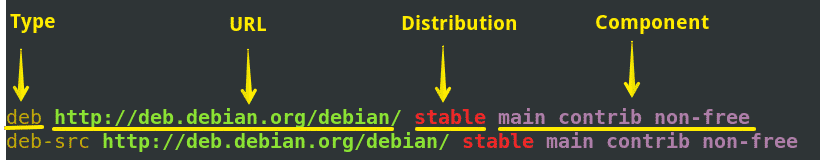
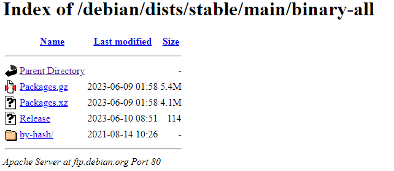
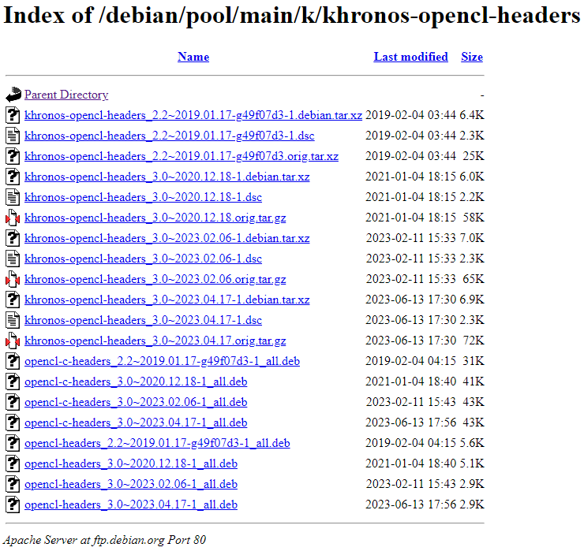

===
APT
===

http://www.ibiblio.org/gferg/ldp/giles/repository/repository-2.html

The Sources.list entry
======================

/etc/apt/sources.list.d

.. code-block:: 

    deb http://chaos/debian    unstable    main local unofficial
        ------ base -------  distribution  ---- components -----

    deb-src http://chaos/debian    unstable    main local unofficial
            ------ base -------  distribution  ---- components -----

    deb http://non-us.debian.org/debian-non-US  stable/non-US  main contrib
        ---------------- base ----------------  distribution   -components-

* **base** http:, ftp: or file: URI.
* **distribution** is usually stable, frozen or unstable for official Debian releases
* **omponent** is usually main, contrib or non-free in official Debian releases

Package directory structure
===========================

.. code-block:: 

    base/dists/distribution/component/binary-all/Packages.gz
    ----       ------------ ---------           /admin/binary-packages
                                                /base/binary-packages
                                                /comm/binary-packages
                                                ...
                                                /Release
                                    /binary-i386/Packages.gz
                                                /admin/binary-packages
                                                /base/binary-packages
                                                /comm/binary-packages
                                                ...
                                                /Release
                                    /binary-sparc/...
                                    /binary-arm/...
                                    /binary-ia86/...
                                    /source/Sources.gz
                                            /admin/binary-packages
                                            /base/binary-packages
                                            /comm/binary-packages
                                            ...
                                            /Release

Apt server example
==================

* Base: http://ftp.debian.org/debian/
* Distribution: stable
* Components: main

Packages.gz
-----------

.. code-block:: 

    Package: opencl-headers
    Source: khronos-opencl-headers
    Version: 3.0~2023.02.06-1
    Installed-Size: 10
    Maintainer: Debian OpenCL Maintainers <pkg-opencl-devel@lists.alioth.debian.org>
    Architecture: all
    Depends: opencl-c-headers (= 3.0~2023.02.06-1), opencl-clhpp-headers (>= 2.0.10)
    Description: OpenCL (Open Computing Language) header files
    Multi-Arch: foreign
    Homepage: https://www.khronos.org/registry/cl/
    Description-md5: 6d11af62fe085fbe0f444907729774d5
    Tag: devel::TODO, devel::lang:c, devel::library, implemented-in::c,
    role::devel-lib
    Section: libdevel
    Priority: optional
    Filename: pool/main/k/khronos-opencl-headers/opencl-headers_3.0~2023.02.06-1_all.deb
    Size: 2984
    MD5sum: 85893c2a7ddb5715cf4d947aad23dc3b
    SHA256: f7249c08d7b963005ce0ee18754e9b23b10835d5d564be2be087e1803a463ed7

* Full link: http://ftp.debian.org/debian/pool/main/k/khronos-opencl-headers/
* Relative link: /debian/pool/main/k/khronos-opencl-headers

