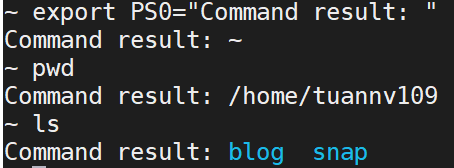
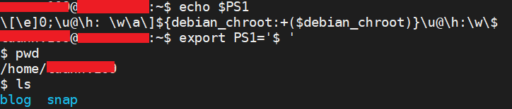

==================
Bash custom prompt
==================

.. list-table::
   :header-rows: 1

   * - Name,shorthand
     - Description
   * - PS0
     - The value of this parameter is expanded and displayed by interactive shells after reading a command and before the command is executed.
   * - PS1
     - The value of this parameter is expanded and used as the primary prompt string. The default value is \s-\v\$.
   * - PS2
     - The value of this parameter is expanded as with PS1 and used as the secondary prompt string. The default is >.
   * - PS3
     - The value of this parameter is used as the prompt for the select command.
   * - PS4
     - The value of this parameter is expanded as with PS1 and the value is printed before each command bash displays during an execution trace. The first character of PS4 is replicated multiple times, as necessary, to indicate multiple levels of indirection. The default is +.

Examples
========

PS0
---

PS1
---

