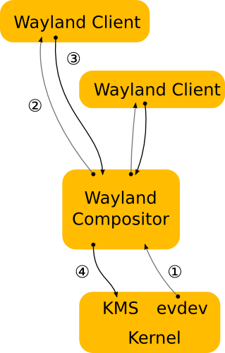

==============
Display Server
==============

Two display servers:

* Xorg (or X display server): legacy display server
* Wayland: relative newer

Check whether Wayland or Xorg is in use?

.. code-block:: 

    echo $XDG_SESSION_TYPE

* :code:`wayland` : Wayland
* :code:`x11`: Xorg

.. code-block:: 

    ➜  ~ ps -ef | grep Xorg
    root        2431    1585  2 11:26 tty7     00:01:00 /usr/lib/xorg/Xorg -core :0 -seat seat0 -auth /var/run/lightdm/root/:0 -nolisten tcp vt7 -novtswitch

.. code-block:: 

    ➜  ~ ps -ef | grep Xwayland
    tuannv    104391  104342  2 12:02 ?        00:00:02 /usr/bin/Xwayland :0 -rootless -noreset -accessx -core -auth /run/user/1000/.mutter-Xwaylandauth.W4AH81 -listen 4 -listen 5 -displayfd 6 -listen 7

Link: https://wayland.freedesktop.org/architecture.html

Xorg
====

Link: https://www.x.org/wiki/

.. image:: imgs/x-architecture.png

1. The kernel gets an event from an input device and sends it to X through evdev input device. The kernel does all of the hardwork here be driving the device and translating the different device specific event protocols to the Linux evdev input event standard.
2. The X server determines which window the event affects and sends it to the clients that have selected for the event it quesion on that window. The X server does not know how to do it right, since the window locatio on screen is controlled by the compositor and may be transformed in a number of ways that the X server does not understand (scaled down, rotated, wobbling, etc)
3. The client looks at the event and decide what to do. Often, the UI will have to change in reponse to the event - perhaps a check box was clicked or the pointer entered a button must be highlighted. Thus the client sends a rendering request back to the X server.
4. When the X server receives the rendering request, it sends it to the driver and let it program the hardware to do the rendering. The X server alose calculates the bounding region of the rendering, and sends that to the compositor as a **damage event**
5. The **damage event** tells the compositor that somthing changed in the window and that it has to recomposite the part of the screen where that window is visible. The compositor is responsible for rendering the entire screen contents based on its scene-graph and the contents of the X windows. Yet, it has to go through the X server to render this.
6. The X server receives the rendering requests from the compositor and either copies the compositor back buffer to the front buffer or does pageflip. In the general case, the X server has to do this step so it can account for overlapping windows, which may require clipping and determinging whether or not it can page flip. However, for a compositor, which is always fullscreen, this is another unneccessary context swictch.

Problems
--------
* The X server doesn't have information do decide whih window should receive the event, nor can it transform the screen coordinates to window-local coordinates. 
* Event though X has handled responsibility for the final painting of the screen to the compositing manager, X still controls the front buffer and modesetting. 
* Most of the complexity that X server used to handle is now available in the kernel or self contained libraries (KMS, evdev, mesa, fontconfig, freetype, cairo, Qt, etc).

In general, the X server is now just a middle man that introduces an extra step between applications and the compositor and an extra step between the compositor and the hardware.

Wayland
=======

Link https://wayland-book.com/

1. The kernel gets an event and sends it ti the compositor. This is similar to the X case, which is great, since we get to reuse all the input driver in the kernel.
2. The compositor loocks through its scence-graph to determine which window should receive the event. The scence-graph corressponds to what's on screen and the compositor understand the transformations that it may have applied to the elements in the scene-graph. Thus, the compositor can pick the right window and transform the screen coordinates to window-local coordinates, by applying inverse transformation. This type of transformation that can be applied to a window is only restrcited to that the compositor can do, as long as it can comput the inverse transformation for the input event.
3. As in the X case, when the client receive the event, it updates the UI in response. But in the Wayland case, the rendering happens in the client, and the client just sends a request to the compositor to indicate the region that was updated.
4. The compositor collects damage requests from its clients and then recomposites the screen. The compositor can then directly issue and ioctl to schedule a pageflip in KMS.

