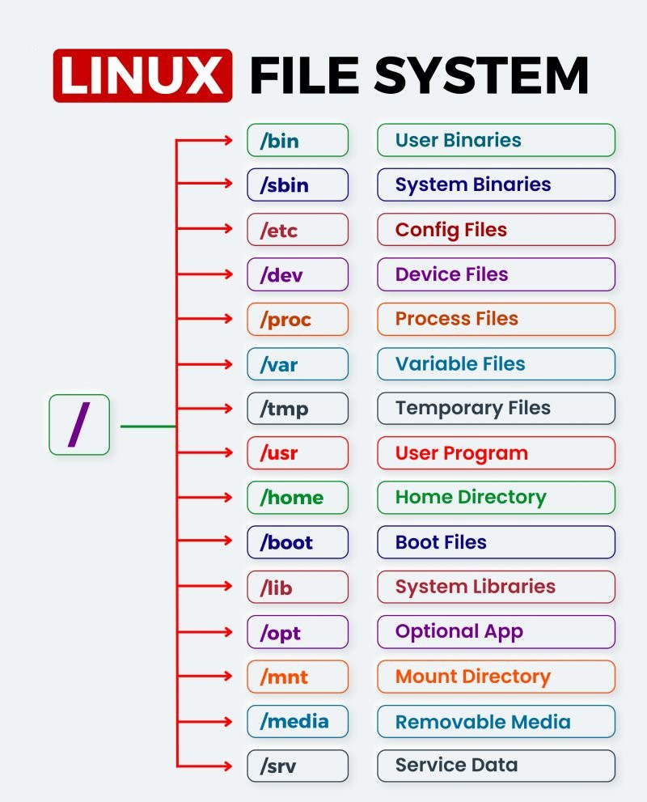
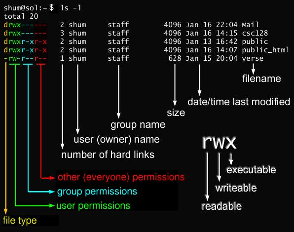
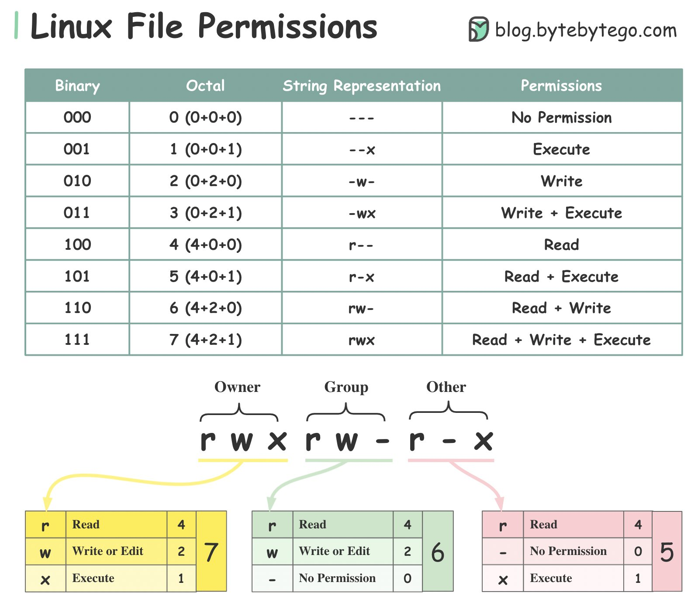

=================
Linux File System
=================

Linux
=====

File Permissions and Links
==========================

.. list-table:: 

  * - Sign
    - Description
  * - :code:`-`
    - Regular files. It contain programs, executable files and text files.
  * - :code:`d`
    - Directory files. It is shown in blue color. It contain list of files.
  * - :code:`b`
    - Block file
  * - :code:`c`
    - Character device file
  * - :code:`p`
    - Named pipe file
  * - :code:`l`
    - Symbolic link file
  * - :code:`s`
    - Socket file

.. code-block:: 

  chmod u=rwx,g=rx,o=r  myfile
  chmod 754             myfile
  chmod u=rw            myfile
  chmod u+x             myfile

Sticky bit
==========

A Sticky bit is a permission bit that is set on a file or a directory that **lets only the owner of the file/directory or the root user to delete or rename the file**. No other user is given privileges to delete the file created by some other user.

.. code-block:: 
  
  chmod +t file
  chmod -t file
