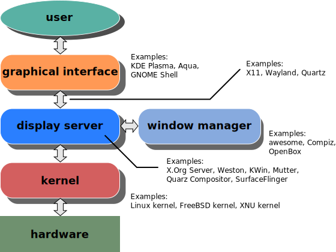

==============================
Linux Graphical User Interface
==============================

.. toctree::

    display_server
    display_client

.. image:: imgs/x_window_system_architecture.png

Desktop Environment
===================

* GNOME
* KDE Plasma
* Xfce
* Cinnamon
* Mate
* LXQt
* Pantheon
* Budgie
* Deepin Desktop Environment (DDE)
* Enlightenment

Window Manager
==============

Types:

* Stacking Window Managers
* Tiling Window Managers
* Dynamic Window Managers
* Floating Window Managers
* Compositing Window Managers
* Lite and Minimalist Window Managers
* Hybrid Window Managers
* Customizable Window Managers

* GNOME Shell
* KWin: KDE Plasma desktop environment
* openbox
* Awesome
