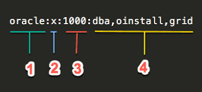
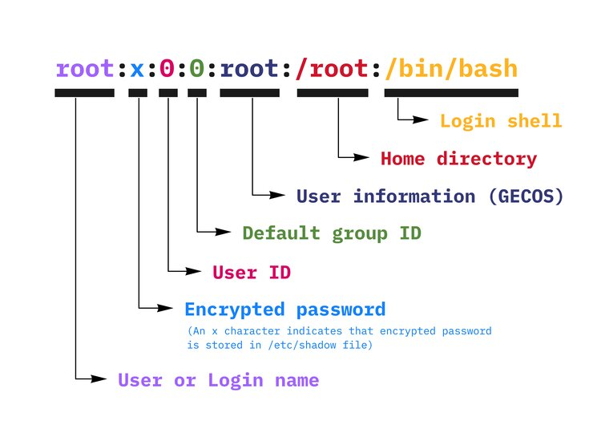
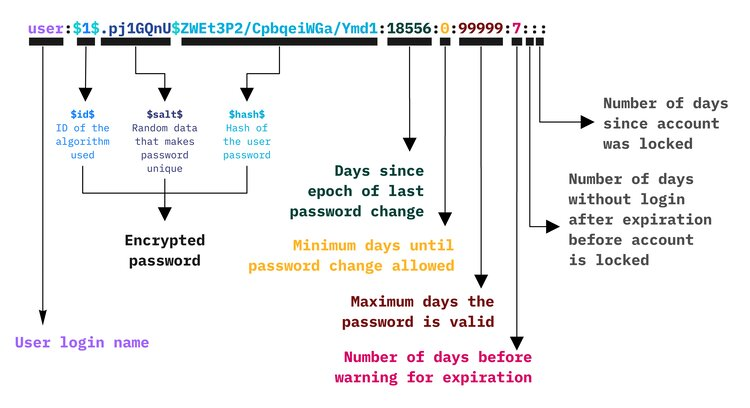

====
User
====

Linux is a multi-user system, which means that more than one person can interact with the same system at the same time.

Groups & Users
==============

.. code-block:: 

    cat /etc/group

    sudo:x:27:ont,hoangtu1,tramtn,tuhn4,ducns3,phatkt

.. list-table:: 

    * - Index
      - Value
      - Description
    * - 1
      - Group name
      - Contains the name assigned to the group.
    * - 2
      - Password
      - Generally password is not used, hence it is empty/blank. It can store encrypted password. This is useful to implement privileged groups.
    * - 3
      - Group ID (GID)
      - Each user must be assigned a group ID.
    * - 4
      - Group List
      - It is a list of user names of users who are members of the group. The user names, must be separated by commas.

.. code-block:: 

    cat /etc/passwd

The gecos field, or GECOS field is a field in each record in the :code:`/etc/passwd` file on Unix and similar operating systems. It is typically used to record general information about the account or its user(s) such as their real name and phone number.

**GECOS** General Electric Comprehensive Operating System

.. code-block:: 

    cat /etc/shadow

ID of the algorithm used:

.. list-table:: 
  
  * - Value
    - Description
  * - :code:`$1$`
    - MD5
  * - :code:`$2$`
    - Blowfish
  * - :code:`$3$`
    - Blowfish
  * - :code:`$4$`
    - SHA-256
  * - :code:`$5$`
    - SHA-512
  * - :code:`$6$`
    - yescrypt

Who am I and What groups I belong to?
-------------------------------------

.. code-block:: 

  whoami
  groups

The id command is preferred command to list groups a user belongs to On Linux or Unix-like operating systems. 

.. code-block:: bash

    id -Gn <username>

User/Group Creation
===================

.. code-block::

  useradd <username>

* When executed without any option, useradd creates a new user account using the default settings specified in the :code:`/etc/default/useradd` file.
* The command adds an entry to the :code:`/etc/passwd`, :code:`/etc/shadow`, :code:`/etc/group` and :code:`/etc/gshadow` files.

To be able to log in as the newly created user, password has to be set for the new user.

.. code-block::

  passwd <username>

.. code-block::

  groupadd <secondarygroup>

While a user account can be part of multiple groups, one of the groups is always the **primary group** and the others are **secondary groups**. The user’s login process and files and folders the user creates will be assigned to the primary group.

.. code-block::

  usermod -g <primarygroup> username

.. code-block::

  usermod -a -G <secondarygroup> username

.. list-table:: usermod
  :widths: 25 25 50
  :header-rows: 1

  * - Options
    - Shorten
    - Description
  * - :code:`--append`
    - :code:`-a`
    - Add the user to the supplementary group(s). Use only with the :code:`-G` option.
  * - :code:`--groups`
    - :code:`-G`
    - A list of supplementary groups which the user is also a member of
  * - :code:`--gid`
    - :code:`-g`
    - The name or numerical ID of the user's new primary group. The group must exist.

User/Group Deletion
===================

.. code-block:: 

    userdel <username>
    groupdel <groupname>

login.defs
==========

.. code-block:: 

  cat /etc/login.defs

  #
  # Min/max values for automatic uid selection in useradd
  #
  UID_MIN                  1000
  UID_MAX                 60000
  # System accounts
  #SYS_UID_MIN              100
  #SYS_UID_MAX              999

  #
  # Min/max values for automatic gid selection in groupadd
  #
  GID_MIN                  1000
  GID_MAX                 60000
  # System accounts
  #SYS_GID_MIN              100
  #SYS_GID_MAX              999

Update User Name
================

.. code-block:: 

  usermod -l new-name old-name

  usermod -u UID username
