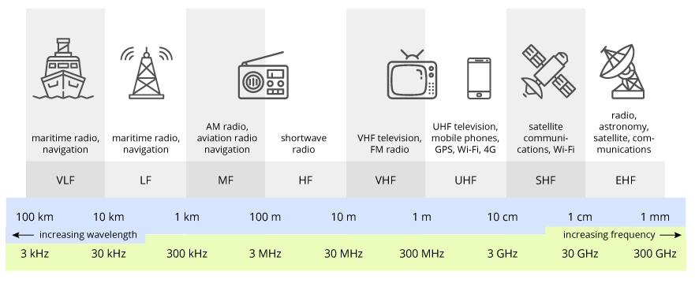

============================================
Wireless and Cellular Communication Overview
============================================

Wireless Communication
----------------------

Wireless communication allows the transfer of information between a transmitter and a receiver, without physical medium.

The same device typically acts as both a transmitter and receiver, by using antennas.

The communication link uses radio frequency (RF) signals to transfer information.

Wireless transmitter
--------------------

A transmitter is in the position of "sending" information.

Wireless receiver
-----------------

A receiver is on the receiving end during wireless transmission.

Radio signal Properties
-----------------------

* All radio signals travel at the speed of light: ~300, 000 km/sec.
* The radio signal's frequency is related to its wave length:

.. math:: 
    \text{frequency} = \frac{\text{speed of light}}{\text{wave length}}

* Frequency is measure in Hertz (Hz): The number of repetitions of the radio signal in one second.

* Wavelength is measured in meters (m): The distance a radio signal travels during a complete cycle.

* A wireless transmission is an electromagnetic signal which is characterized by its wavelength and frequency.

  * Radio frequency (RF) range from **3 kilohertz (kHz)** to **300 Gigahertz(GHz)**.
  * Their wave lengths range from 100 kilometers (km) to 1 millimeter (mm).

Visible Light vs Radio Wave Comparison
--------------------------------------

* Visible Light Wave: ~415 - ~750 nm of wavelength

* Radio wavelength is 1500x more than visible light

Carrier Waves and Modulation
----------------------------

* Information to be exchanged is "carried" by radio frequency (RF) signals.
  
  * Information can be analog, such as voice, or digital, such as web traffic.

* RF signals used as a vehicle for information transfer are often referred to as Carrier Waves.
* **Modulation** is the process by which we impress information onto the carrier wave for transmission.

  * Analog or Digital modulation can be performed depending on the nature of the data.

* At the receiver, we must **demodulate** the carrier to recover our data.

MODEM = MOdulation + DEModulation

Wireless Transmission and Reception
-----------------------------------

Radio signal power attenuates due to transmission loss.

Noise and interference may also be introduced.

Transmitter (Tx) send information: More Power = Better Coverage.

Receiver (Rx) reacquires information: More sensitivity = Better reception.

Noise and Interference
----------------------

When information is sent over any wireless communication link, **Noise** and possibly **Interference** is introduced.

* Noise is unwanted energy os signals

  * Noise is always present in any device or communication link.
  * Some noise is generated within communication device

* When two nearby transmitters use the same radio frequency at the same time, they create interfere.

Noise and Interfere reduce quality of signal received by the user.

In case of high noise and interference. the transmitter signal may be no be recovered.

We qualify signal quality by the ratio of desired signal to noise and/or interference.

.. math:: 

  \text{SNR} = \frac{\text{Signal}}{\text{Noise}}

.. math:: 

  \text{SINR} = \frac{\text{Signal}}{\text{Noise} + \text{Interference}}

Radio Spectrum
--------------

Radio spectrum is simply the range of radio frequencies over which wireless communication takes palce for a specifi purpose.

The frequencies or radio spectrum allocated to **mobile phones** range from approximately **450MHz** to **39GHz**.

Radio Channel and Bandwidth
---------------------------

A radio signal that carries information uses a range of frequencies over which the communication link is establish.

That range of frequency is called a channel and its width is called bandwidth.

The radio channel is offen compared to a data pipe: a wider channel implies a bigger data pipe and higher data rate.

The radio channel can be loosely classified as:

* Narrowband: Radio signal occupies a smaller amount of radio spectrum (~kHz)
* Wideband: Radio signal occupies a larger amount of radio sepectrum (~MHz)

Sharing the Radio Channel
-------------------------

Sharing the radio channel allows **mutiple access**.

CDMA (Code Division Mutiple Access)

Two Ways of Sharing the Spectrum: FDD & TDD
-------------------------------------------

Two ways to sharing the limited (and expensive) spectrum.

* FDD:

  * A pair of radio channel for simutanious two-way communication.
  * Both sides can transmit information at the same time on independent links.

    * Downlink:  Base station transmits
    * Uplink: Phone transmits

* TDD:

  * A single radio channel but used in different directions at different times.
  * Cheaper and more flexible than FDD, but at the expense of data speeds.

Factors Affecting Data Rate
---------------------------

Serveral factors affect the data rate, i.e., the speed your phone gets.

* How many bars does my phone have?
  
  * How good is my connection? SNR: Signal to Noise Ratio

* How wide is my channel, and how crowded is it?
* How frequently, and efficiently, can my phone use the available channel?

The Cellular Concept
--------------------
* The FM radio station and a mobile network cover the city differently
* A mobile network's coverage area is divided into "cells"

  * Each cell is served by a Base station a.k.a a "tower".
  * The cells are designed to have "tessellating" coverage.
  * As you drive around, you are **handed off** from one Base Station to the next by the network.
  
Area lacking coverage within a cell or at the cell boundary can result in dropped calls.

When a user moves between the cells and transferred from one base station to other, it is called a **handoff** or **handover**.

What Is A Cellular Network?
---------------------------
The radio access network (RAN) provides wireless connections to users.
  
* Base stations are interconnected -> Ubiquitous mobile coverage.
* User commuinicate with one base station at a time.
  
The core network connects the RAN to the service networks/

* Authenticate and network access.
* Switch, routing, and seamlessly connectivity to servicces.
