======================
5G Spectrum and mmWave
======================

The 5G NR Spectrum
==================

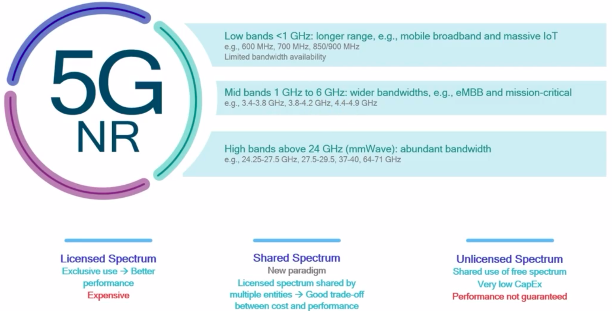

Motivation and Challenges behind mmWave
=======================================

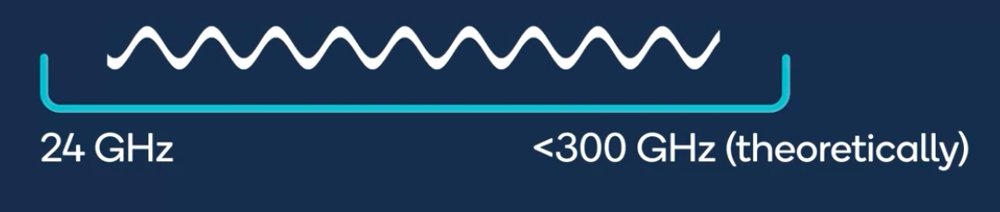

What is mmWave?

* Spectrum where radio wavelength is a few millimeters: above 24 GHz
* 5G mmWave spectrum is around 28GHz and 39 GHz
* Spectrum above 52 GHz is also being considered

Why mmWave?

* Currently, mmWave is largely unused --> ample spectrum available
* Enormous bandwidth -> mmWave can fulfull the demand of data-hungry 5G use cases

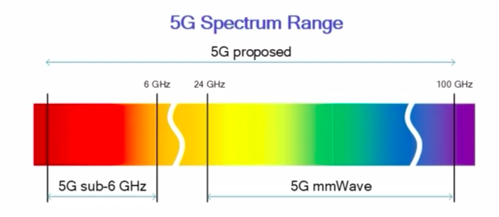

Challenges?

* Inferior propagation: higher frequency -> significantly higher path loss
* Building penetration loss: Deep indoor coverage is challenging
* Severe attenuation due to rain and foliage

Despite these challenges, 5G can leverage certain advantages of mmWave.

Advantages of high-frequency:

* Large bandwidth --> Less crowding
* More antennas --> Higher generation
* More directivity --> Better focus --> Higher spectral efficiency
* High Pathloss and directivity --> Better Spacial resource

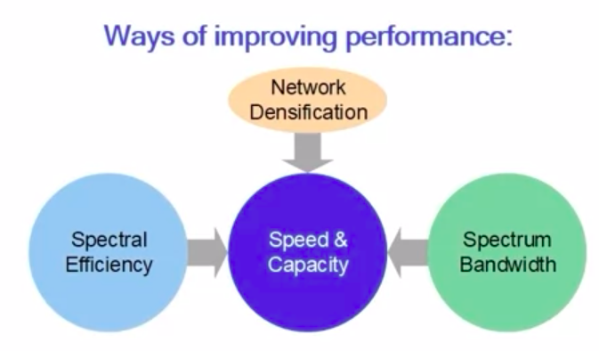

Advantages of mmWave
====================

As frequency of operation goes higher, the wireless antenna size gets smaller.

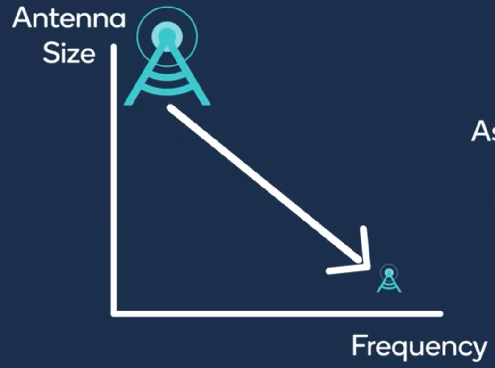

    Frequency and antenna size

Small mmWave antennas enable the possibility of designing antenna arrays.

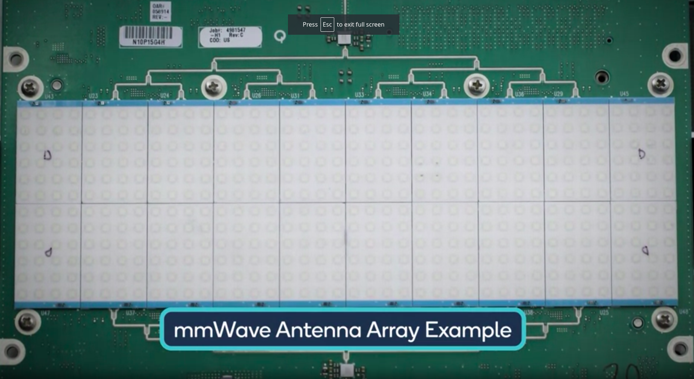

As more antennas are capable of transmitting more energy, they provide "higher gain".

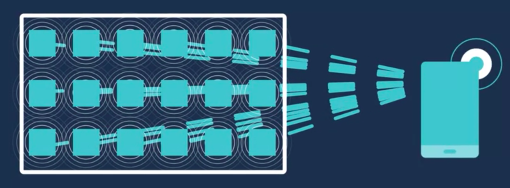

Operation mode:

* Each antenna can send signals in seperate directions.
* All the antennas in the array can act cohesively as one entity.
* When all the antennas focus their energy in the same direction, higher directivity provided.

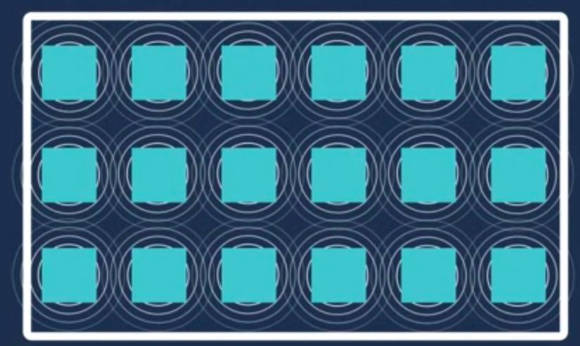

Advantage of high-frequency:

* Large bandwidth --> less crowding
* More antennas --> higher gain
* High directivity --> Better focus --> Higher sepectral efficiency
* Higher Pathloss and Driectivity --> Better spacial reuse

mmWave Deployment Oppotunities Overview
=======================================

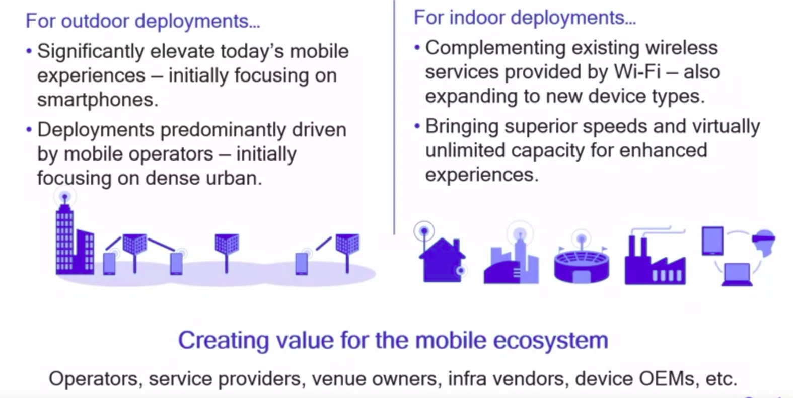

mmWave for Urban & SubUrban Deployments
=======================================

* 5G mmWave Coverage/Capacity
* 5G mmWave Last Mile Solution: Use 5GmmWave to replace fiber cable between OLT and ONT

mmWave for Rural Deployments
============================

* 5G mmWave Backhaul for Rural Deployment
    * mmWave could replace fiber backhaul at a cost efficient manner. Particularly benificial in rural deployments with low building and user densities
    * In addition to backhaul, mmWave can also be used for coverage extension

mmWave for fixed wireless access
================================

Fixed Wireless Access

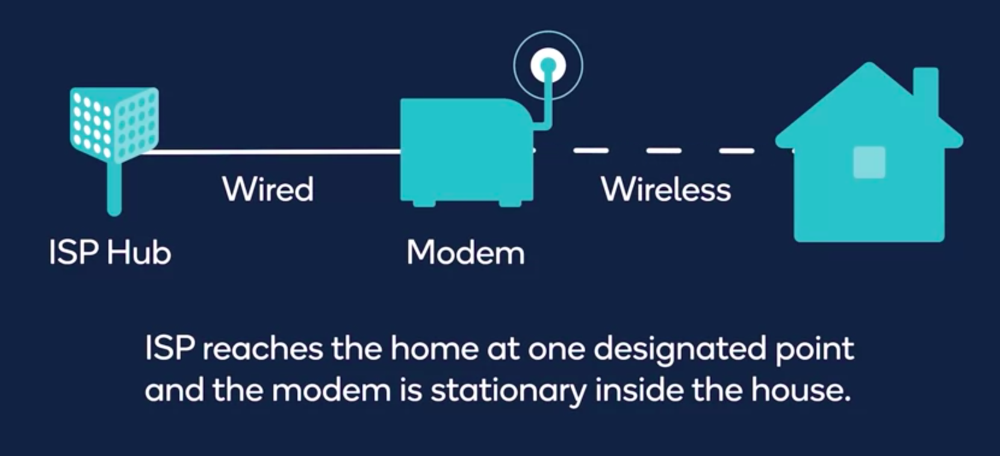

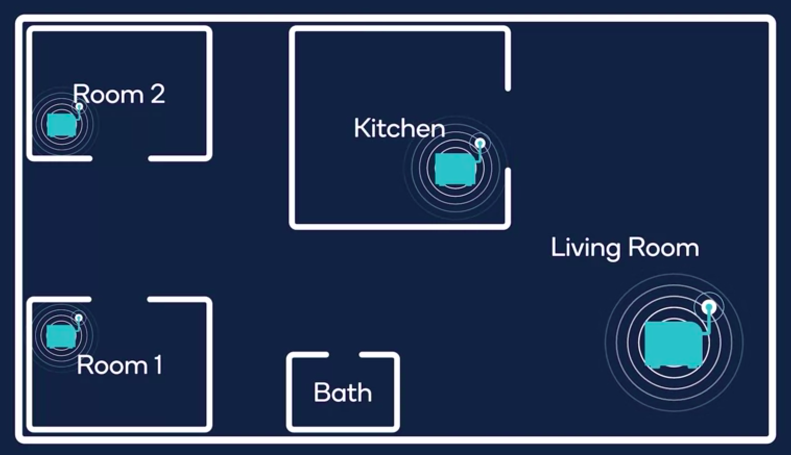

Indoor & Venue Deployments of mmWave
====================================

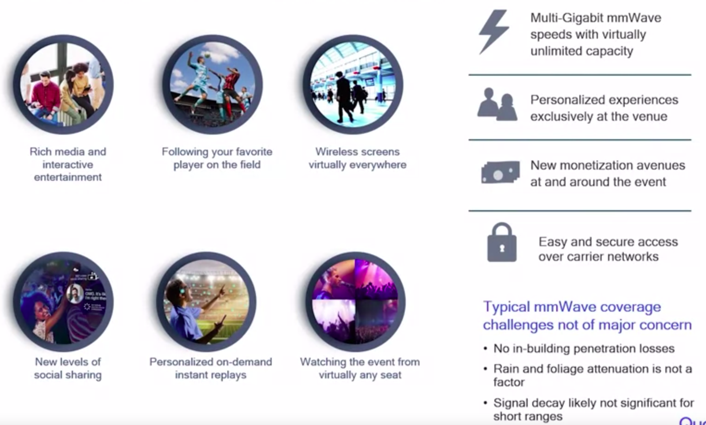

Real-life mmWave Case Study
===========================

Massive Capacity and New Experiences

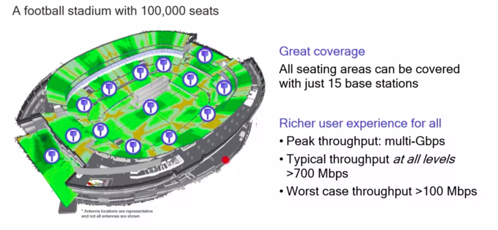

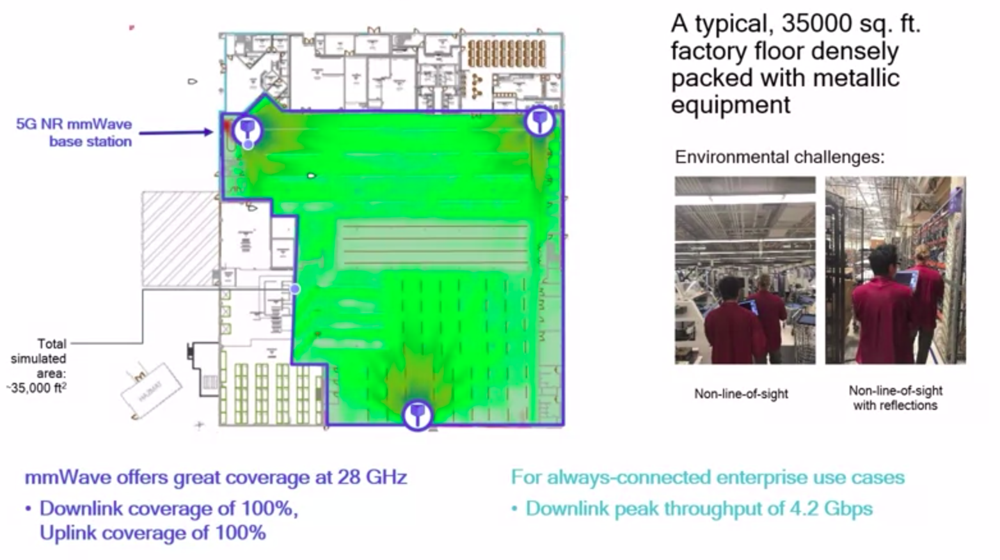

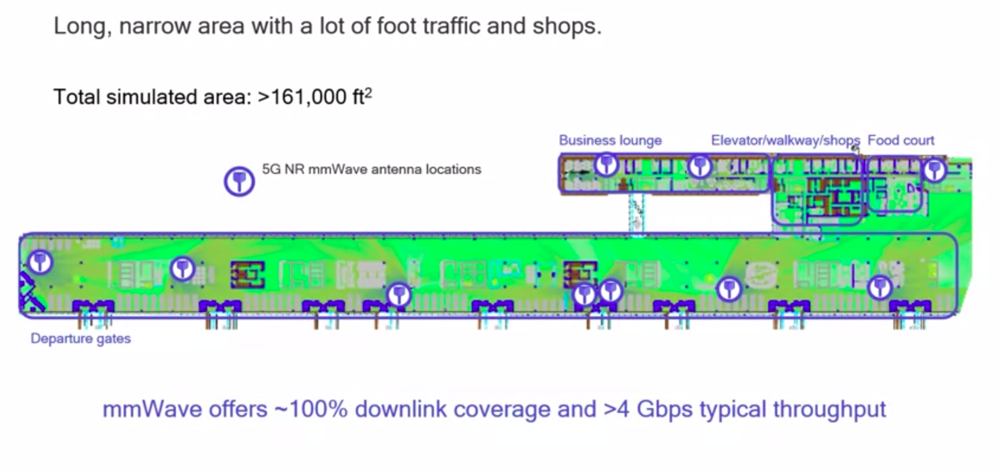
