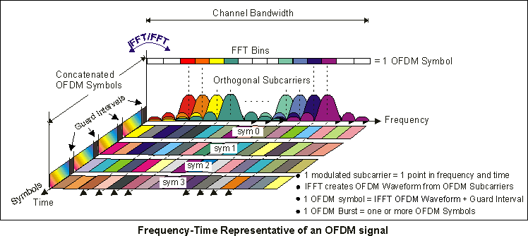

=======================
5G Network and Features
=======================

5G Network Terminology and Concepts
===================================

* gNodeB (gNB): Base station a.k.a. 'tower' for 5G wireless networks; support connectivity to 5G core network (NGC)
* Access & Mobility Management Function (AMF): Supports UE's network access and manages its mobility
* Session Management Function (SMF): Support signaling for IP address allocation and connectivity
* User Plan Function (UPF): Handle all content generated/consumed by apps, e.g., web pages

Network Architecture Options for 5G NR
======================================

* Standalone (SA) option
* Non-standalone (NSA) option

5G Techniques Overview
======================

* Flexible slot-based framework
* Scalable OFDM-based air interface
* Advanced channel coding
* Massive MIMO
* Mobile mmWave

.. image:: imgs/5g_techniques_overview.png

Flexible Slot-Based Framework
=============================

Scalable OFDM-Based Air Interface
=================================

Advanced Channel Coding
=======================

Massive MIMO
============

Mobile mmWave (Milimeter Wave)
==============================

5G Network Principles And Features Overview
===========================================

5G network architecture is guided by certain key principles:

* Independence of software from hardware
* Decouple of compute and storage resources
* Separation of user plane (application data) from control plane (signaling)
* Cloud-compatible desgin: flexible and easily scalable

The following features enable 5G network to implement principles above in reality:

* Network Slicing
* SDN: Software Define Network
* NFV: Network Function Virtualization
* MEC: Mobile Edge computing

Network Slicing
===============

* A slice is a subset of the available network components that can provide an E2E service.
* A slice can be designed and commissioned deppending upon the needs of a service.
* Diverse requirements of different services an be met by serving them with different slice of the same network, i.e., different components of the same infrastructure.
* Benefits:

  * Dynamic and efficient resources allocation and utilization, resource isolation among services.
  * Flexible subsription model. 

Splitting resources to network slices enables the ability to serve different use cases on the same network.
