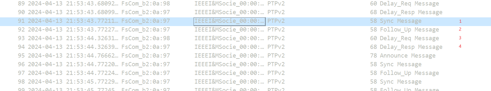

# PTP via switch 

## Topology

PC (enp1s0f0) -- (P5) SW (P6) -- (enp1s0f1) PC

## Result

### Master

```
fcp@fcp-B760-GAMING-X-AX:~$ sudo ptp4l -i enp1s0f0 -2 -m
[sudo] password for fcp: 
ptp4l[448476.249]: selected /dev/ptp0 as PTP clock
ptp4l[448476.308]: port 1: INITIALIZING to LISTENING on INITIALIZE
ptp4l[448476.308]: port 0: INITIALIZING to LISTENING on INITIALIZE
ptp4l[448476.309]: port 1: link up
ptp4l[448482.889]: port 1: LISTENING to MASTER on ANNOUNCE_RECEIPT_TIMEOUT_EXPIRES
ptp4l[448482.889]: selected best master clock 649d99.fffe.b20a97
ptp4l[448482.889]: assuming the grand master role
```

### Slave

```
fcp@fcp-B760-GAMING-X-AX:~$ sudo ptp4l -i enp1s0f1 -2 -m -s
ptp4l[448712.150]: selected /dev/ptp1 as PTP clock
ptp4l[448712.196]: port 1: INITIALIZING to LISTENING on INITIALIZE
ptp4l[448712.197]: port 0: INITIALIZING to LISTENING on INITIALIZE
ptp4l[448712.197]: port 1: link up
ptp4l[448712.899]: port 1: new foreign master 649d99.fffe.b20a97-1
ptp4l[448716.900]: selected best master clock 649d99.fffe.b20a97
ptp4l[448716.900]: port 1: LISTENING to UNCALIBRATED on RS_SLAVE
ptp4l[448718.905]: master offset         38 s0 freq      -1 path delay       412
ptp4l[448719.905]: master offset         40 s2 freq      +1 path delay       413
ptp4l[448719.905]: port 1: UNCALIBRATED to SLAVE on MASTER_CLOCK_SELECTED
ptp4l[448720.905]: master offset         40 s2 freq     +41 path delay       413
ptp4l[448721.905]: master offset         -3 s2 freq     +10 path delay       415
ptp4l[448722.905]: master offset        -10 s2 freq      +2 path delay       415
ptp4l[448723.905]: master offset        -24 s2 freq     -15 path delay       416
ptp4l[448724.905]: master offset        -13 s2 freq     -11 path delay       415
ptp4l[448725.905]: master offset         10 s2 freq      +8 path delay       408
ptp4l[448726.905]: master offset          9 s2 freq     +10 path delay       408
ptp4l[448727.906]: master offset         -8 s2 freq      -4 path delay       408
ptp4l[448728.906]: master offset         -3 s2 freq      -2 path delay       406
ptp4l[448729.906]: master offset          6 s2 freq      +6 path delay       406
ptp4l[448730.906]: master offset         -4 s2 freq      -2 path delay       406
ptp4l[448731.906]: master offset         -4 s2 freq      -3 path delay       406
ptp4l[448732.906]: master offset         -1 s2 freq      -1 path delay       410
ptp4l[448733.906]: master offset         -1 s2 freq      -1 path delay       414
ptp4l[448734.906]: master offset         -7 s2 freq      -8 path delay       414
ptp4l[448735.906]: master offset         -1 s2 freq      -4 path delay       415
ptp4l[448736.906]: master offset          4 s2 freq      +1 path delay       415
ptp4l[448737.906]: master offset         -4 s2 freq      -6 path delay       415
ptp4l[448738.906]: master offset          7 s2 freq      +4 path delay       415
ptp4l[448739.907]: master offset         -3 s2 freq      -4 path delay       415
ptp4l[448740.907]: master offset         12 s2 freq     +10 path delay       414
ptp4l[448741.907]: master offset        -11 s2 freq      -9 path delay       414
ptp4l[448742.907]: master offset          9 s2 freq      +7 path delay       414
ptp4l[448743.907]: master offset        -10 s2 freq      -9 path delay       414
ptp4l[448744.907]: master offset         -1 s2 freq      -3 path delay       414
ptp4l[448745.907]: master offset         15 s2 freq     +13 path delay       413
ptp4l[448746.908]: master offset         -8 s2 freq      -6 path delay       413
ptp4l[448747.908]: master offset         10 s2 freq     +10 path delay       410
ptp4l[448748.908]: master offset          3 s2 freq      +6 path delay       410
ptp4l[448749.908]: master offset        -19 s2 freq     -15 path delay       412
ptp4l[448750.908]: master offset          3 s2 freq      +1 path delay       412
^Cfcp@fcp-B760-GAMING-X-AX:~$ 
```

### Wireshark

[enp1s0f0](./pcap/enp1s0f0.pcapng)

[enp1s0f1](./pcap/enp1s0f1.pcapng)


