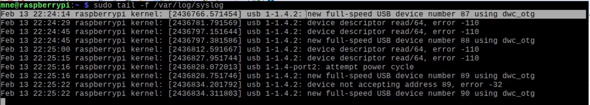

===
USB
===

Packets
=======

    HID-MOUSE

.. _hid-mouse: 

Link: `Cloudshark <https://www.cloudshark.org/captures/a6c9580208b7?filter=frame.number%3D%3D1+%7C%7C+frame.number%3D%3D61+%7C%7C+frame.number%3D%3D66+%7C%7C+frame.number%3D%3D75+%7C%7C+%28frame.number%3E%3D77+%26%26+frame.number%3C%3D78%29+%7C%7C+frame.number%3D%3D80+%7C%7C+frame.number%3D%3D82+%7C%7C+frame.number%3D%3D84+%7C%7C+frame.number%3D%3D86+%7C%7C+frame.number%3D%3D88+%7C%7C+frame.number%3D%3D90+%7C%7C+frame.number%3D%3D92+%7C%7C+frame.number%3D%3D94+%7C%7C+frame.number%3D%3D98+%7C%7C+frame.number%3D%3D100+%7C%7C+frame.number%3D%3D102+%7C%7C+frame.number%3D%3D104+%7C%7C+frame.number%3D%3D162+%7C%7C+frame.number%3D%3D167>`_

Code
====

    
    USBD initialialization

    
    New USB device without desctiptions
