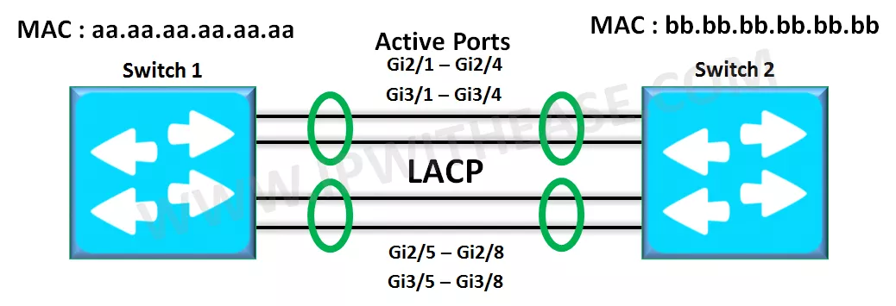

====
LACP
====

* **Active Mode** In this, the switch actively asks the far end to negotiate an ether channel.

* **Passive Mode** In this mode, the switch waits to hear from the far end to negotiate an ether channel and doesn't actively ask to negotiate an ether channel.

