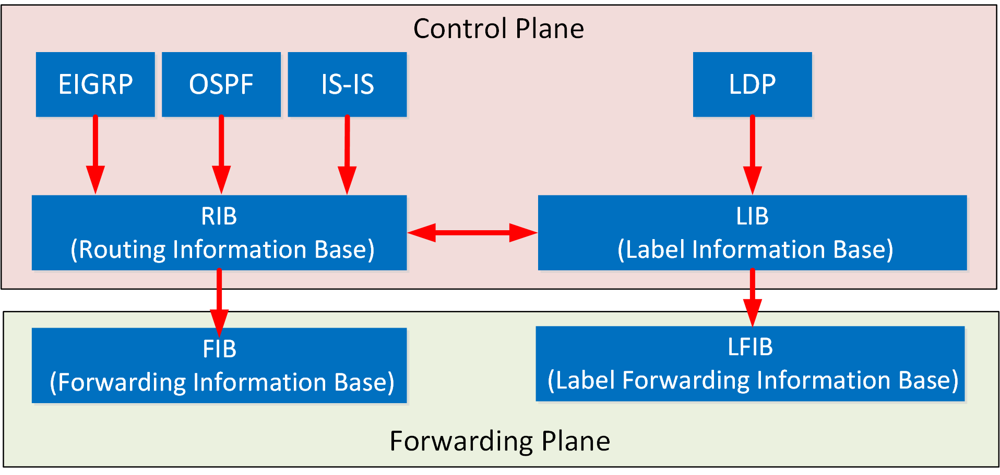
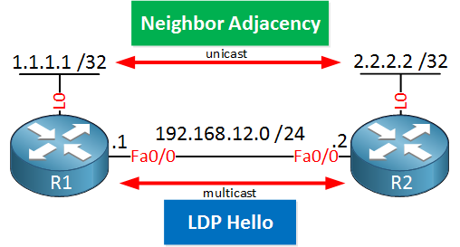
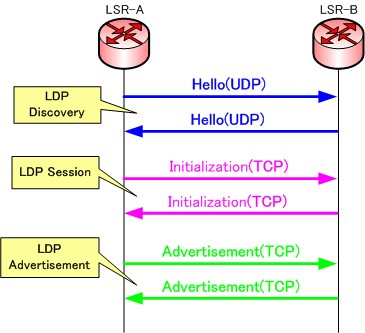
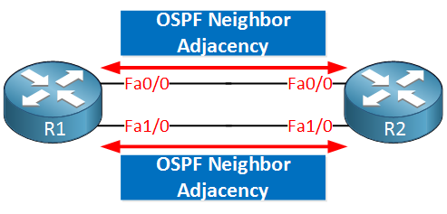
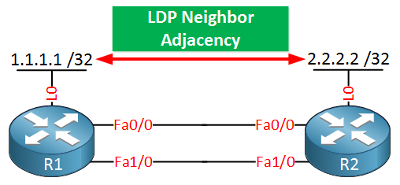
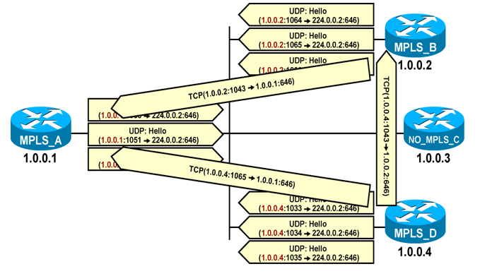
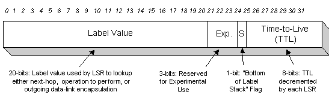
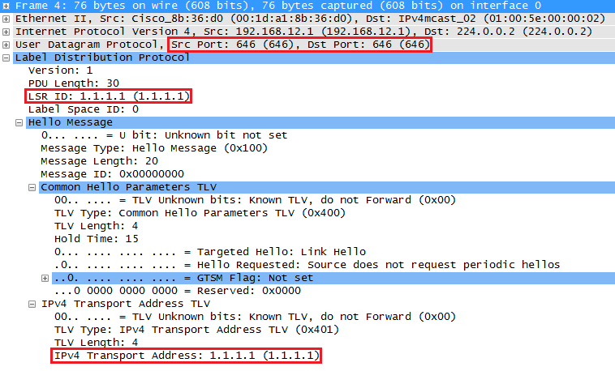
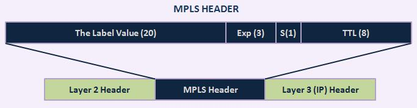

===
LDP
===

The two routers above will send multicast hello packets on their FastEthernet interfaces. Within this hello packet, they will advertise a **transport IP address**. This IP address is then used to establish the TCP connection between the two routers.

OSPF vs LDP Adjacency 
=====================

LDP Packets
===========

