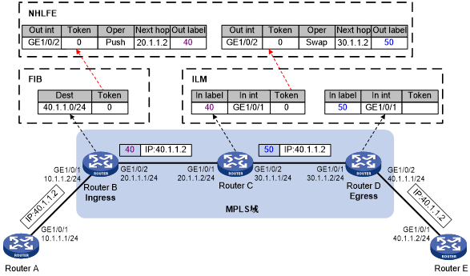

===============
MPLS Forwarding
===============

Link: https://techhub.hpe.com/eginfolib/networking/docs/switches/5820x-5800/5998-7393r_mpls_cg/content/441756023.htm

LFIB
====

Label Forward Information Base

.. list-table:: 

    * - Acronym
      - Full Name
      - Description
    * - NHLFE
      - Next Hope Label Forwarding Entry
      - Describes the label operation to be performed. It is used to forward MPLS packets.
    * - FTN
      - FEC to NHLFE map
      - FTN maps each FEC to a set of NHLFEs at the ingress LSR. The FTN map is used for forwarding unlabeled packets that need MPLS forwarding. When an LSR receives an unlabeled packet, it looks for the corresponding FIB entry. If the Token value of the FIB entry is not Invalid, the packet must be forwarded through MPLS. The LSR then looks for the corresponding NHLFE entry according to the Token value to determine the label operation to be performed.
    * - ILM
      - Incoming Label Map
      - ILM maps each incoming label to a set of NHLFEs. It is used to forward labeled packets. When an LSR receives a labeled packet, it looks for the corresponding ILM entry. If the Token value of the ILM entry is not null, the LSR looks for the corresponding NHLFE entry to determine the label operation to be performed.

FTN and ILM are associated with NHLFE through Token.

MPLS data forwarding
====================

PHP
===

* IPv4 explicit null label 0
* Implicit null label 3

Queue scheduling for MPLS
=========================
