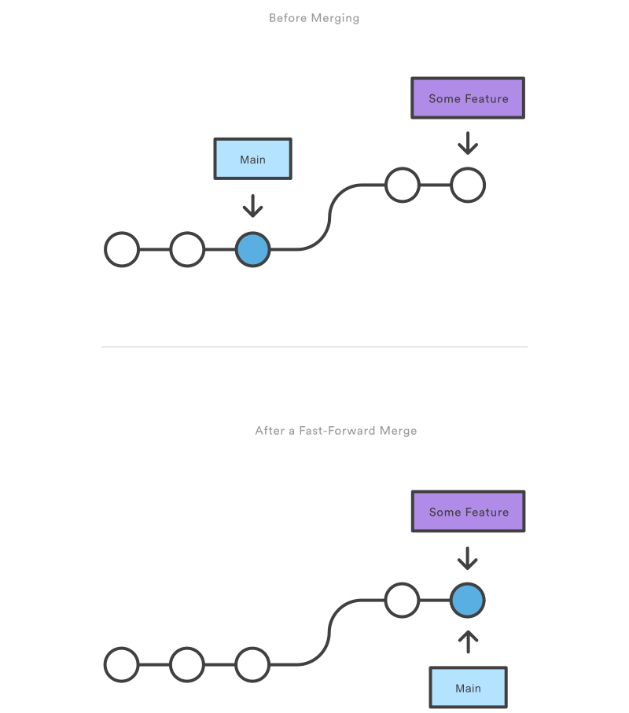
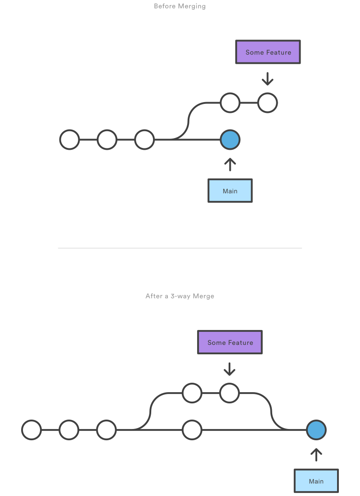

===
Git
===

Configurations
==============

User global git configuration file :file:`~/.gitconfig`.

List configurations

.. code-block:: 

    git config --list

Global Username and Email
-------------------------

.. code-block:: 

    git config --global user.name "tuannv"
    git config --global user.email "tuannv.email@gmail.com"

Fetch
=====

* Fetch branches and/or tags (collectively, "refs") from one or more other repositories, along with the objects necessary to complete their histories.
* When no remote is specified, by default the **origin** remote will be used, unless there’s an upstream branch configured for the current branch.

.. code-block::

    git fetch [<options>] [<repository> [<refspec>…​]]

.. list-table:: 
    
    * - Options
      - Description
    * - :code:`<refspec>`
      - Specifies which refs to fetch and which local refs to update. When no <refspec>s appear on the command line, the refs to fetch are read from remote.<repository>.fetch variables instead 
  
Fetch master branch from remote named origin

.. code-block::

    git fetch origin master

Merge
=====

.. code-block::

    git merge [-n] [--stat] [--no-commit] [--squash] [--[no-]edit]
      [--no-verify] [-s <strategy>] [-X <strategy-option>] [-S[<keyid>]]
      [--[no-]allow-unrelated-histories]
      [--[no-]rerere-autoupdate] [-m <msg>] [-F <file>]
      [--into-name <branch>] [<commit>…​]
    git merge (--continue | --abort | --quit)

.. code-block::

          A---B---C topic
         /
    D---E---F---G master

.. code-block:: bash

  (master)# git merge topic

.. code-block::

          A---B---C topic
         /         \
    D---E---F---G---H master

Fast Forward Merge
------------------

A fast-forward merge can occur when there is a linear path from the current branch tip to the target branch. 

3-way Merge
------------

3-way merges use a dedicated commit to tie together the two histories. The nomenclature comes from the fact that Git uses three commits to generate the merge commit: the two branch tips and their common ancestor.

Squash Merge
------------

.. image:: imgs/squash_merge.png

Pull
====

.. code-block:: 
  
  git pull [<options>] [<repository> [<refspec>…​]]

.. code-block:: C

        A---B---C master on origin
      /
  D---E---F---G master
      ^
      origin/master in your repository

.. code-block:: c

        A---B---C origin/master
      /           \
    D---E---F---G---H master

Clean
=====

Remove untracked files from the working tree

.. code-block::

    git clean -n

.. list-table::
    
    * - Options
      - Shorten
      - Description
    * - :code:`--dry-run`
      - :code:`-n`
      - Don't actually remove anything, just show what would be done.
    * - :code:`--force`
      - :code:`-f`
      - If the Git configuration variable clean.requireForce is not set to false, git clean will refuse to delete files or directories unless given -f or -i.
    * - 
      - :code:`-x`
      - Don't use the standard ignore rules
    * - 
      - :code:`-X`
      - Remove only files ignored by Git
    * - 
      - :code:`-d`
      - Normally, when no <pathspec> is specified, git clean will not recurse into untracked directories to avoid removing too much. Specify -d to have it recurse into such directories as well.

Reset
=====
Reset current HEAD to the specified state

.. code-block::

    [Dangerous] git reset --hard

[Dangerous] Clear all changes
=============================
.. code-block::

    git reset --hard
    git clean -fdx
