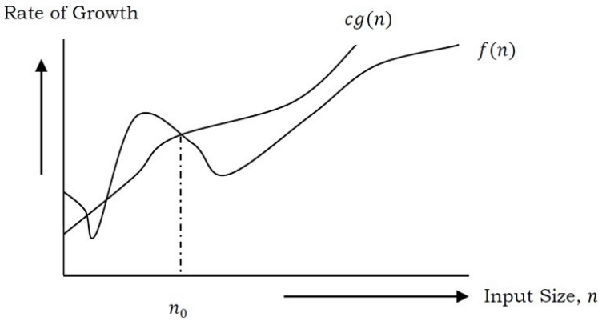
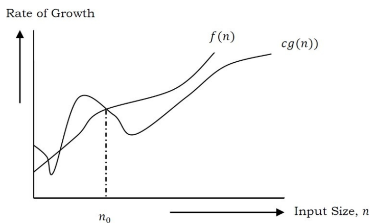
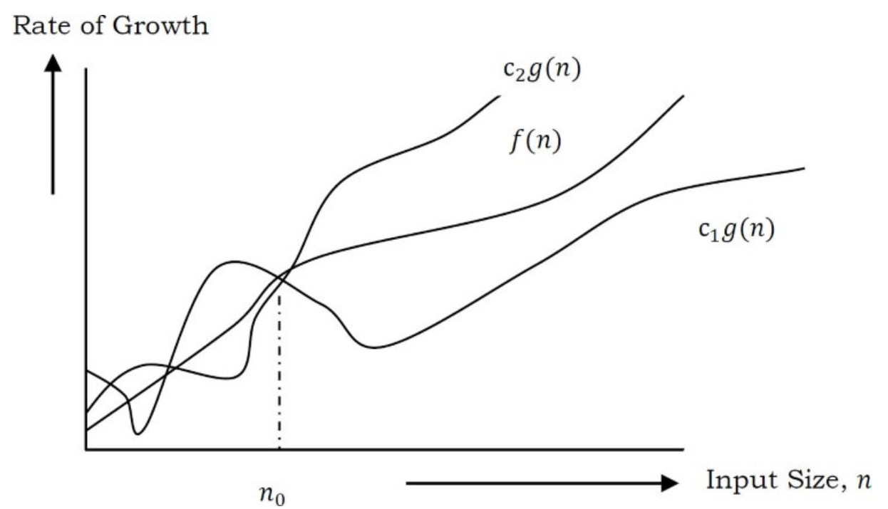

============
Introduction
============

Variables
=========

.. math:: 
    
    x^2 + 2y - 2 = 1

Data types
==========

* System defined data types (Primitive data types) : int, float, char, double, bool, etc...

* User defined data types
    
  * struct in C/C++
  * class in Java

Data structure
==============

* **Linear data structure**: Elements are accessed in a sequential order but it is not compulsory to store all elements sequentially (say, Linked Lists). Examples: Arrays, Linked Lists, Stacks and Queues.
* **Non-linear data structure**: Elements of this data structure are stored/accessed in a non-linear order: Examples: Trees and Graphs

Abstract Data Types (ADTs)
==========================

An ADT consists of **two** parts:

#. Declaration of data
#. Declaration of operations

Examples: Stacks
----------------

#. LIFO (Last-In-First-Out) machanism while storing the data in data structures
#. Operations: creating, pushing eb element, popping an element, getting number of elements, etc...

What is an Algorithm
====================

An algorithm is the step-by-step unambiguous instructions to solve a given problem.

**Two** criterias for judging the merits of algorithms:

* **Correctness** Does the algorithm give solution to the problem in a finite number of steps.
* **Efficiency** How much resources (in term of memory and time) does it take to execute the algorithm.

Why the Analysis of Algorithms?
===============================

In computer science, multiple algorithms are available for solving the same problem. Algorithm analysis helps us to determine which algorithm is most efficient in terms of time and space consumed.

Goal of the Analysis of Algorithm?
==================================

The goal of the analysis of algorithms is to compare algorithms (or solutions) mainly in terms of running time but also in terms of other factors (e.g. memory, developer effort, etc.)

What is Running Time Ananlysis?
===============================

It is the process of determining how processing time increases as the size of the problem increases.

How to Compare Algorithms?
==========================

* Execution times?
* Number of statements executed?
* Ideal solution? Running time of a given algorithm as a function of the input size and compare these different functions corressponding to running times. This kind of comparation is independent of machine time, programming style, etc.

What is Rate of Growth?
=======================

The rate at which the running time increases as a function of input is called **rate of growth**.

Commonly Used Rates of Growth
=============================

.. math:: 

  1 < \log{\log{n}} < \sqrt{\log{n}} < \log{n} <\log^2{n} < 2^{\log{n}} < n 
  < \log(n!) < n \log{n} < n^2 < 2^n < 4^n < n! < 2^{2^n}

Types of Analysis
=================

* **Worst case**
  
  * Define the input for which the algorithm takes a long time (slowest time to comeplete).
  * Input is the one for which the algorithm runs the slowest.

* **Best case**

  * Defines the input for which the algorithm takes the least time (fastest time to complete).
  * Input is the one for which the algorithm runs the fastest.

* **Average case**
  
  * Provides a prediction about the running time of the algorithm.
  * RUn the algorithm many times. using many different inputs that come from some distribution that generates these inputs, compute the total running time (by adding individual times), and divide by number of trials.
  * Assumes that the input is random.

.. math:: 

  \text{Lower Bound} <= \text{Average Time} <= \text{Upper Bound}

Asymptotic Notation
===================

Big :math:`\mathcal{O}` Notation (Upper Bounding Function)
==========================================================

.. math:: 

  f(n) = \mathcal{O}(g(n))

At larger value of n, the upper bound of :math:`f(n)` is :math:`g(n)`.

For example:

.. math:: 

  f(n) &= n^4 + 100n^2 + 10n + 50 \\
  g(n) &= n^4

:math:`g(n)` gives the maximum rate of growth for :math:`f(n)` at larger values of :math:`n`.

There exist positive constants :math:`c` and :math:`n_0` such that :math:`0 \le f(n) \le c g(n)` for all :math:`n > n_0`.

.. Our objective is to give the smallest rate of grow :math:`g(n)` which is greater than or equal to given :math:`\text{algorithms' rate of growth}/n`

.. math:: 

  \mathcal{O}(1) &: 100, 1000, 200, 1, 20, etc. \\
  \mathcal{O}(n) &: 3n + 100, 100n, 2n-1, etc.  \\
  \mathcal{O}(n\log{n}) &: 5n\log{n}, 3n-100, 2n-1,100,100n, etc.\\
  \mathcal{0}(n^2) &: n^2, 5n-10, 100, n^2-2n+1, 5, etc.

Big :math:`\mathcal{O}` Notation Examples
-----------------------------------------

**Example-1**: Find upper bound for :math:`f(n) = 100`

**Solution**:

:math:`100 \le 100 \times 1`, for all :math:`n \ge 0`

:math:`100 = \mathcal{O}(1)` with :math:`c=100` and :math:`n_0=0`

**Example-2**: Find upper bound for :math:`f(n) = 3n + 8`

**Solution**:

:math:`3n+ 8 \le 4n`, for all :math:`n \ge 8` 

:math:`3n+8 = \mathcal{O}(n)` with :math:`c=4` and :math:`n_0=8`

**Example-3**: Find upper bound for :math:`f(n) = n^4 + 100n^2+50`

**Solution**:

:math:`n^4 + 100n^2+50 \le 2n^4`, for all :math:`n \ge 11` 

:math:`n^4 + 100n^2+50  = \mathcal{O}(n^4)` with :math:`c=2` and :math:`n_0=11`

No Uniqueness?
--------------

There is no unique set of values for :math:`n_0` and :math:`c` in proving the asymtotic bounds.

Example: :math:`100n+5 = \mathcal{O}(n)`

**Solution 1**: :math:`n_0 = 5` and :math:`c=101`

**Solution 2**: :math:`n_0 = 1` and :math:`c=105`

:math:`\Omega` Notation (Lower Bounding Function)
=================================================

.. math:: 

  f(n) = \Omega(g(n))

At larger value of n, the tighter lower bound of :math:`f(n)` is :math:`g(n)`.

There exist positive constants :math:`c` and :math:`n_0` such that :math:`0 \le c g(n) \le f(n)` for all :math:`n > n_0`.

:math:`\Omega` Examples
-----------------------

**Example-1**: Find upper bound for :math:`f(n) = 5n^2`

**Solution**:

:math:`0 < 5n^2 \le 5n^2 = f(n)`, for all :math:`n \ge 1`

:math:`5n^2 = \Omega(n^2)` with :math:`c=5` and :math:`n_0=1`

:math:`\Theta` Notation
=======================

:math:`\Theta` Examples
-----------------------

**Example-1**: Find :math:`\Theta` bound for :math:`f(n) = \frac{n^2}{2} - \frac{n}{2}`

**Solution**:

:math:`\frac{n^2}{5} \le \frac{n^2}{2} - \frac{n}{2} \le n^2`, for all :math:`n \ge 2`

:math:`\frac{n^2}{2} - \frac{n}{2} = \Theta(n^2)` with :math:`c_1 = 1/5`, :math:`c_2 = 1` and :math:`n_0 = 2`

Why is it called Asymtotic Analysis?
====================================

:math:`g(n)` is also a curve which approximates :math:`f(n)` at higher values of :math:`n`.

